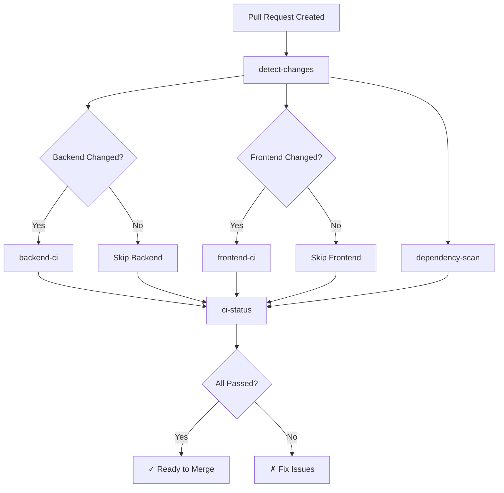

# CI/CD Quick Reference

## Running CI Checks Locally

### Backend
```bash
cd backend

# Checkstyle linting
mvn checkstyle:check

# Run tests
mvn clean test

# Run tests with coverage
mvn clean verify

# Full build
mvn clean package
```

### Frontend
```bash
cd frontend

# Install dependencies
npm ci

# Format check
npx prettier --check "src/**/*.{ts,html,scss,css}"

# Run tests
npm run test -- --watch=false --browsers=ChromeHeadless --code-coverage

# Build
npm run build
```

## Workflow Triggers

| Workflow | Trigger | When |
|----------|---------|------|
| **ci.yml** | `pull_request`, `push` | PRs or pushes to main/develop |
| **codeql.yml** | `pull_request`, `push`, `schedule` | PRs, pushes, or weekly |
| **backend-ci.yml** | `pull_request`, `push` | Changes in `backend/**` (not main) |
| **frontend-ci.yml** | `pull_request`, `push` | Changes in `frontend/**` (not main) |

## CI Workflow Jobs



## Status Check Requirements

Before merging to `main` or `develop`, these must pass:

- ✅ Backend - Build & Test
- ✅ Frontend - Build & Test  
- ✅ Security - Dependency Scan
- ✅ CI Status Check
- ✅ Analyze Code (java)
- ✅ Analyze Code (javascript)

## Common CI Issues & Solutions

### ❌ Backend tests fail
```bash
# Check logs in Actions tab
# Run locally:
cd backend && mvn clean test

# Common fixes:
# - Update dependencies: mvn clean install
# - Check Java version: java -version (should be 21)
```

### ❌ Frontend tests fail
```bash
# Run locally:
cd frontend && npm ci && npm run test

# Common fixes:
# - Clear node_modules: rm -rf node_modules && npm ci
# - Check Node version: node -v (should be 20+)
```

### ❌ Dependency scan fails
```bash
# Check for vulnerable dependencies
# Backend: mvn dependency:tree
# Frontend: npm audit

# Fix:
# Backend: Update version in pom.xml
# Frontend: npm audit fix
```

### ❌ CodeQL fails
```bash
# Usually indicates security issues in code
# Check Security tab for details
# Review and fix flagged code
```

### ⚠️ Checkstyle warnings
```bash
# Non-blocking, but should be addressed
cd backend && mvn checkstyle:check
# Fix formatting issues manually
```

## Artifacts

Download from Actions → Workflow Run → Artifacts

- **Test Results**: JUnit/Karma test reports
- **Coverage Reports**: JaCoCo/Istanbul coverage
- **Build Artifacts**: Compiled backend/frontend
- **Security Scans**: Trivy SARIF reports

## Emergency: Skip CI Checks

**⚠️ Not recommended! Only for emergencies.**

Add to commit message:
```
[skip ci]
```

**Better approach:** Fix the issue and push a fix!

## Useful Commands

```bash
# Check workflow syntax locally
python3 -c "import yaml; yaml.safe_load(open('.github/workflows/ci.yml'))"

# Test workflow with act (local GitHub Actions runner)
act pull_request

# View recent workflow runs
gh run list --workflow=ci.yml

# Re-run failed workflow
gh run rerun <run-id>

# View workflow logs
gh run view <run-id> --log
```

## Resources

- [GitHub Actions Documentation](https://docs.github.com/en/actions)
- [Workflow Syntax](https://docs.github.com/en/actions/using-workflows/workflow-syntax-for-github-actions)
- [CONTRIBUTING.md](../../CONTRIBUTING.md)
- [Branch Protection Setup](./BRANCH_PROTECTION.md)
