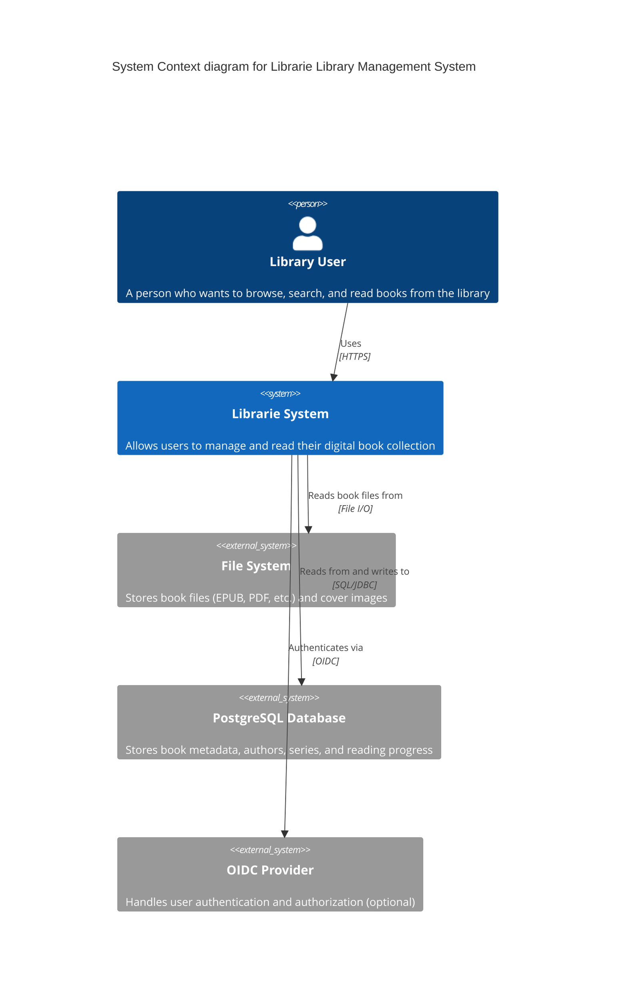
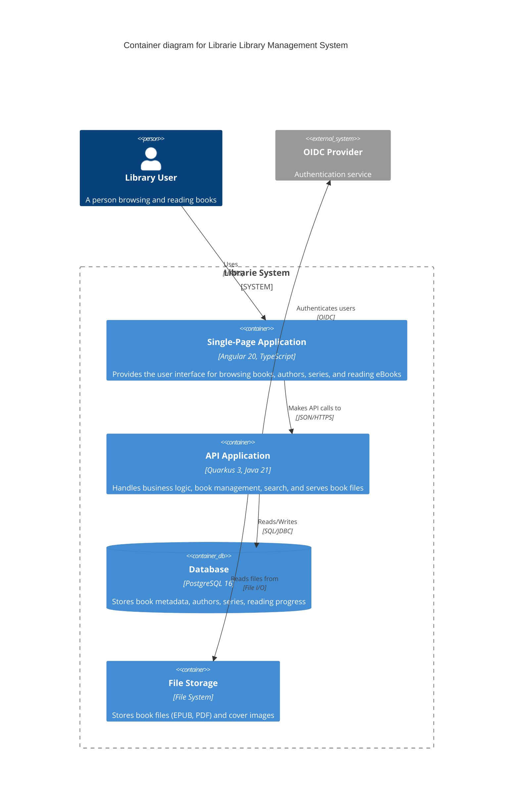
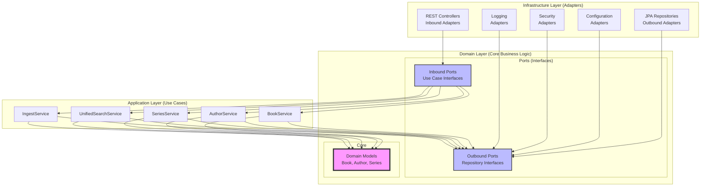
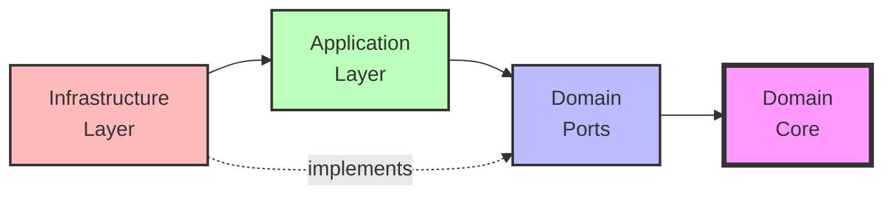
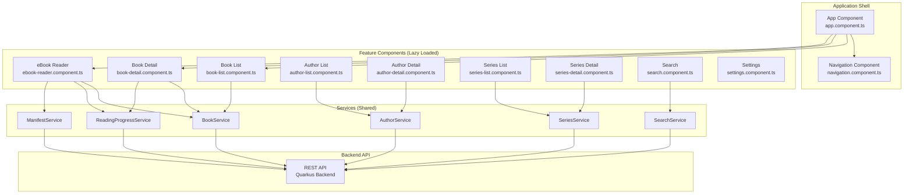
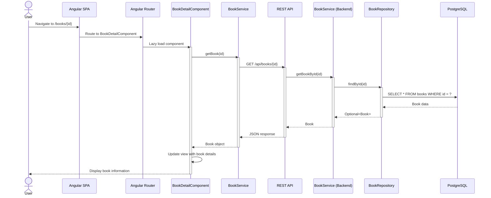
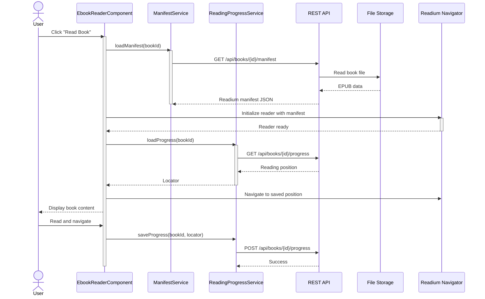
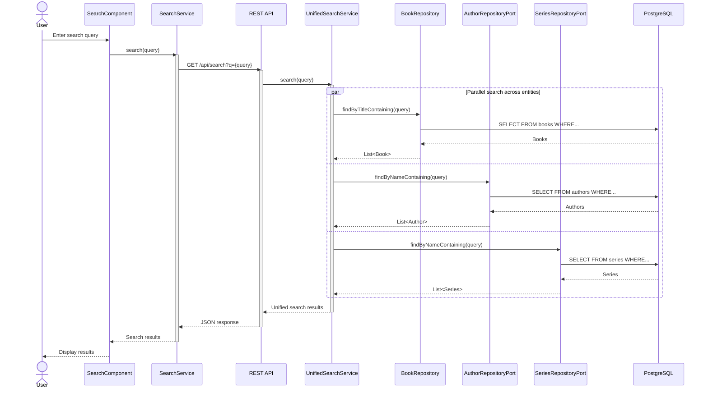
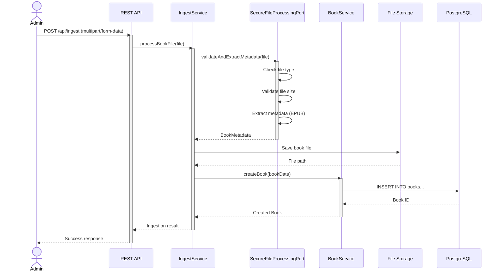

# Librarie - System Architecture Documentation

## Table of Contents

1. [System Overview](#system-overview)
2. [C4 Model - System Context](#c4-model---system-context)
3. [C4 Model - Container Architecture](#c4-model---container-architecture)
4. [Backend Hexagonal Architecture](#backend-hexagonal-architecture)
5. [Frontend Component Structure](#frontend-component-structure)
6. [Data Flow Examples](#data-flow-examples)
7. [Architectural Decision Records](#architectural-decision-records)

## System Overview

Librarie is a modern library management system built with a clear separation between backend and frontend concerns. The system allows users to manage books, authors, and series, with support for reading eBooks directly in the browser.

### Key Technologies

- **Backend**: Quarkus 3.25 (Java 21), PostgreSQL, Flyway
- **Frontend**: Angular 20, TypeScript 5.8, Readium Web Reader
- **Architecture Pattern**: Hexagonal Architecture (Ports & Adapters)
- **API Communication**: RESTful JSON API
- **Build Tools**: Maven (backend), Angular CLI (frontend)

## C4 Model - System Context

The following diagram shows the system context and external actors interacting with Librarie.



### System Boundaries

- **Internal System**: Librarie (Backend + Frontend)
- **External Dependencies**: 
  - File System for storing book files and assets
  - PostgreSQL for persistent data storage
  - OIDC Provider for authentication (optional, configurable)

## C4 Model - Container Architecture

The container diagram shows the high-level architecture of the Librarie system.



### Container Descriptions

#### Single-Page Application (SPA)
- **Technology**: Angular 20 with TypeScript
- **Purpose**: Provides the user interface for all library operations
- **Key Features**:
  - Book browsing and searching
  - Author and series management
  - Integrated eBook reader using Readium
  - Responsive design with Angular Material
  - Lazy-loaded routes for optimal performance

#### API Application
- **Technology**: Quarkus 3.25 with Java 21
- **Purpose**: Backend business logic and API endpoints
- **Key Features**:
  - RESTful API endpoints
  - Hexagonal architecture implementation
  - Book file serving and processing
  - Search functionality
  - Health checks and metrics (OpenTelemetry)

#### Database
- **Technology**: PostgreSQL 16
- **Purpose**: Persistent storage of structured data
- **Key Data**:
  - Books, Authors, Series
  - Reading progress
  - User settings
  - Metadata and relationships

#### File Storage
- **Technology**: File system (local or mounted)
- **Purpose**: Storage of binary assets
- **Contents**:
  - Book files (EPUB, PDF, MOBI, etc.)
  - Cover images
  - Author pictures

## Backend Hexagonal Architecture

The backend follows the Hexagonal Architecture (also known as Ports and Adapters) pattern to maintain clear separation of concerns and ensure testability.

### Architecture Layers



### Package Structure

```
org.motpassants/
├── domain/                          # Domain Layer (Core)
│   ├── core/
│   │   └── model/                   # Domain entities (Book, Author, Series)
│   └── port/
│       ├── in/                      # Inbound ports (Use Case interfaces)
│       │   ├── BookUseCase.java
│       │   ├── AuthorUseCase.java
│       │   └── SeriesUseCase.java
│       └── out/                     # Outbound ports (Repository interfaces)
│           ├── BookRepository.java
│           ├── AuthorRepositoryPort.java
│           └── SeriesRepositoryPort.java
├── application/                     # Application Layer (Use Cases)
│   └── service/
│       ├── BookService.java         # Implements BookUseCase
│       ├── AuthorService.java       # Implements AuthorUseCase
│       └── SeriesService.java       # Implements SeriesUseCase
└── infrastructure/                  # Infrastructure Layer (Adapters)
    ├── adapter/
    │   ├── in/                      # Inbound adapters
    │   │   └── rest/                # REST Controllers
    │   │       ├── BookController.java
    │   │       ├── AuthorController.java
    │   │       └── SeriesController.java
    │   └── out/                     # Outbound adapters
    │       ├── persistence/         # JPA implementations
    │       ├── config/              # Configuration adapters
    │       ├── security/            # Security adapters
    │       └── logging/             # Logging adapters
    ├── config/                      # Framework configuration
    ├── security/                    # Security configuration
    ├── media/                       # Media processing
    └── readium/                     # Readium integration
```

### Dependency Rules

The hexagonal architecture enforces strict dependency rules (validated by ArchUnit tests):

1. **Domain Core** → No external dependencies (only Java standard library)
2. **Domain Ports** → Only Domain Core
3. **Application Layer** → Domain Ports + Domain Core
4. **Infrastructure Layer** → Can access all layers (implements ports)



### Key Architectural Principles

1. **Dependency Inversion**: Core business logic (domain) doesn't depend on infrastructure
2. **Interface Segregation**: Ports are focused interfaces defining specific use cases
3. **Separation of Concerns**: Each layer has a clear, single responsibility
4. **Testability**: Domain logic can be tested without infrastructure
5. **Framework Independence**: Domain logic is independent of Quarkus or any framework

## Frontend Component Structure

The frontend follows Angular best practices with standalone components, lazy loading, and signal-based state management.

### Component Architecture



### Frontend Structure

```
frontend/src/app/
├── components/                      # Feature components
│   ├── book-list.component.ts       # Book browsing
│   ├── book-detail.component.ts     # Book details
│   ├── ebook-reader.component.ts    # Readium-based reader
│   ├── author-list.component.ts     # Author browsing
│   ├── author-detail.component.ts   # Author details
│   ├── series-list.component.ts     # Series browsing
│   ├── series-detail.component.ts   # Series details
│   ├── search.component.ts          # Unified search
│   ├── settings.component.ts        # User settings
│   └── navigation.component.ts      # Navigation bar
├── services/                        # Shared services
│   ├── book.service.ts              # Book API client
│   ├── author.service.ts            # Author API client
│   ├── series.service.ts            # Series API client
│   ├── search.service.ts            # Search API client
│   ├── reading-progress.service.ts  # Progress tracking
│   └── manifest.service.ts          # Readium manifest
├── models/                          # TypeScript interfaces
├── directives/                      # Custom directives
├── shared/                          # Shared components
├── utils/                           # Utility functions
└── app.routes.ts                    # Route configuration
```

### Key Frontend Patterns

1. **Standalone Components**: All components are standalone (no NgModules)
2. **Lazy Loading**: Routes use dynamic imports for code splitting
3. **Signal-based State**: Using Angular signals for reactive state management
4. **Service Layer**: Services encapsulate API communication
5. **Type Safety**: Strong TypeScript typing throughout
6. **Responsive Design**: Angular Material for consistent UI

## Data Flow Examples

### Use Case 1: Viewing Book Details

This diagram shows the complete flow when a user views book details.



### Use Case 2: Reading an eBook

This diagram shows the flow for opening and reading an eBook.



### Use Case 3: Searching Books



### Use Case 4: Ingesting New Books



## Architectural Decision Records

### ADR-001: Hexagonal Architecture for Backend

**Status**: Accepted

**Context**: 
We needed an architecture that provides clear separation of concerns, testability, and independence from frameworks and external dependencies.

**Decision**: 
Implement hexagonal architecture (ports and adapters pattern) with three main layers:
- Domain layer (core business logic, pure Java)
- Application layer (use cases, orchestration)
- Infrastructure layer (adapters for REST, persistence, etc.)

**Consequences**:
- **Positive**: 
  - Clear dependency rules enforced by ArchUnit tests
  - Business logic independent of frameworks
  - Easy to test without infrastructure
  - Can swap implementations without changing core logic
- **Negative**: 
  - More boilerplate code (interfaces for ports)
  - Steeper learning curve for developers unfamiliar with the pattern
  - More files and packages to navigate

**Enforcement**: 
ArchUnit tests in `HexagonalArchitectureTest.java` automatically validate architecture rules.

### ADR-002: Angular Standalone Components

**Status**: Accepted

**Context**: 
Angular 14+ introduced standalone components as a simpler alternative to NgModules. We needed to decide on the component architecture for a new application.

**Decision**: 
Use standalone components exclusively without NgModules, with lazy loading for all feature routes.

**Consequences**:
- **Positive**: 
  - Simpler mental model (no need to understand NgModules)
  - Better tree-shaking and smaller bundles
  - Easier to maintain and understand
  - Lazy loading becomes simpler
- **Negative**: 
  - Less familiar to developers from older Angular versions
  - Some third-party libraries may not fully support standalone components

### ADR-003: Quarkus Framework for Backend

**Status**: Accepted

**Context**: 
We needed a modern Java framework optimized for cloud-native applications with fast startup and low memory footprint.

**Decision**: 
Use Quarkus 3.x as the backend framework instead of Spring Boot or Jakarta EE.

**Consequences**:
- **Positive**: 
  - Fast startup time (~1 second)
  - Low memory footprint
  - Native compilation support with GraalVM
  - Developer-friendly with hot reload
  - Built-in support for modern standards (MicroProfile, OpenTelemetry)
- **Negative**: 
  - Smaller ecosystem compared to Spring
  - Less mature tooling and documentation
  - Some reflection-based libraries may not work in native mode

### ADR-004: PostgreSQL for Data Storage

**Status**: Accepted

**Context**: 
We needed a relational database that supports complex queries, full-text search, and JSONB for flexible metadata storage.

**Decision**: 
Use PostgreSQL 16 as the primary database with Flyway for migrations.

**Consequences**:
- **Positive**: 
  - Excellent support for complex queries and relationships
  - JSONB support for flexible metadata
  - Strong ACID guarantees
  - Mature, well-documented, and widely adopted
  - Full-text search capabilities
- **Negative**: 
  - Requires separate database server (more complex deployment)
  - Horizontal scaling requires additional tools (vs NoSQL)

### ADR-005: Readium for eBook Reading

**Status**: Accepted

**Context**: 
We needed a robust, standards-compliant eBook reader that works in modern browsers.

**Decision**: 
Integrate Readium Web Reader (@readium/navigator) for EPUB reading functionality.

**Consequences**:
- **Positive**: 
  - Industry-standard EPUB support
  - Actively maintained by EDRLab
  - Supports Readium Web Publication Manifest
  - Good accessibility features
  - Works across modern browsers
- **Negative**: 
  - Complex integration and configuration
  - Large library size impacts bundle size
  - Limited documentation for advanced features

### ADR-006: REST API over GraphQL

**Status**: Accepted

**Context**: 
We needed to choose an API style for client-server communication.

**Decision**: 
Use RESTful JSON API with cursor-based pagination instead of GraphQL.

**Consequences**:
- **Positive**: 
  - Simple, well-understood pattern
  - Easy to cache with HTTP
  - Standard tooling and libraries
  - Lower learning curve
- **Negative**: 
  - Potential for over-fetching or under-fetching data
  - Multiple requests may be needed for related data
  - No built-in schema introspection

### ADR-007: Flyway for Database Migrations

**Status**: Accepted

**Context**: 
We needed a reliable way to manage database schema changes across environments.

**Decision**: 
Use Flyway for versioned database migrations with SQL scripts.

**Consequences**:
- **Positive**: 
  - Version-controlled database schema
  - Automatic migration on startup
  - Rollback support
  - Works across all environments consistently
  - Simple SQL scripts (no ORM-specific DSL)
- **Negative**: 
  - Must be careful with migration order
  - Failed migrations can be tricky to recover from
  - Requires discipline in writing migrations

### ADR-008: UUID Primary Keys

**Status**: Accepted

**Context**: 
We needed to choose between auto-incrementing integers and UUIDs for primary keys.

**Decision**: 
Use UUIDs (UUID v4) as primary keys for all entities.

**Consequences**:
- **Positive**: 
  - Globally unique without coordination
  - Safe for distributed systems
  - No sequential guessing of IDs
  - Easier to merge data from different sources
- **Negative**: 
  - Larger index size (16 bytes vs 4/8 bytes)
  - Less human-friendly URLs
  - Slightly slower joins compared to integers
  - No inherent ordering

### ADR-009: Angular Signals for State Management

**Status**: Accepted

**Context**: 
Angular 16+ introduced signals as a new reactive primitive. We needed to choose between RxJS, signals, or a state management library.

**Decision**: 
Use Angular signals as the primary state management approach, with RxJS for asynchronous operations.

**Consequences**:
- **Positive**: 
  - Fine-grained reactivity
  - Better performance than zone.js
  - Simpler mental model than RxJS for simple state
  - First-class support from Angular team
  - Can interop with RxJS when needed
- **Negative**: 
  - New concept for Angular developers
  - RxJS still needed for complex async flows
  - Less mature ecosystem compared to RxJS

### ADR-010: Demo Mode for Development

**Status**: Accepted

**Context**: 
Developers need sample data to test the application without setting up a full book library.

**Decision**: 
Implement a demo mode that generates realistic sample data on startup using the DemoDataService.

**Consequences**:
- **Positive**: 
  - Quick onboarding for new developers
  - Easier to test features without real data
  - Demonstrates system capabilities
  - Configurable via application.properties
- **Negative**: 
  - Extra code to maintain
  - Could be accidentally enabled in production
  - Generated data may not represent all edge cases

---

## Conclusion

This architecture document provides a comprehensive overview of the Librarie system. The hexagonal architecture in the backend ensures clean separation of concerns and testability, while the modern Angular frontend provides a responsive and performant user experience.

For implementation details, refer to:
- Backend code: `/backend/src/main/java/org/motpassants/`
- Frontend code: `/frontend/src/app/`
- Database schema: `/backend/src/main/resources/db/migration/`
- Architecture tests: `/backend/src/test/java/org/motpassants/architecture/`

For questions or clarifications, please refer to the README.md or reach out to the development team.
