# Librarie Database Schema - Entity Relationship Diagram

This diagram shows the optimized database schema for the Librarie library management system, designed for PostgreSQL 16 with performance and scalability in mind.

```mermaid
erDiagram
    %% Core Content Tables
    BOOKS {
        uuid id PK "Primary key"
        text title "Book title"
        text title_sort "Sortable title"
        text isbn "ISBN identifier"
        text path "File path from library root"
        bigint file_size "File size in bytes"
        char file_hash "SHA-256 hash for deduplication"
        boolean has_cover "Cover image exists"
        timestamptz created_at "Record creation time"
        timestamptz last_modified "Last modification time"
        date publication_date "Publication date"
        char language_code FK "Language reference"
        jsonb metadata "Flexible metadata storage"
        tsvector search_vector "Full-text search index"
    }
    
    AUTHORS {
        uuid id PK "Primary key"
        text name "Author full name"
        text sort_name "Sortable name (Last, First)"
        text bio "Author biography"
        date birth_date "Birth date"
        date death_date "Death date"
        text website_url "Author website"
        jsonb metadata "Additional metadata"
        timestamptz created_at "Record creation"
    }
    
    ORIGINAL_WORKS {
        uuid id PK "Primary key"
        text title "Original work title (first publication)"
        text title_sort "Sortable title"
        text description "Work description"
        date first_publication_date "First publication date"
        jsonb metadata "Additional metadata"
        timestamptz created_at "Record creation"
        timestamptz last_modified "Last modification time"
    }
    
    ORIGINAL_WORK_EXTERNAL_IDS {
        uuid id PK "Primary key"
        uuid original_work_id FK "Original work reference"
        text identifier_type "Type (isbn, lccn, oclc, goodreads, etc.)"
        text identifier_value "External identifier value"
        timestamptz created_at "Record creation"
    }
    
    SERIES {
        uuid id PK "Primary key"
        text name "Series name"
        text sort_name "Sortable series name"
        text description "Series description"
        jsonb metadata "Additional metadata"
        timestamptz created_at "Record creation"
    }
    
    TAGS {
        uuid id PK "Primary key"
        text name "Tag name"
        text category "Tag category (genre, subject, etc.)"
        char color "Hex color code for UI"
        timestamptz created_at "Record creation"
    }
    
    PUBLISHERS {
        uuid id PK "Primary key"
        text name "Publisher name"
        text website_url "Publisher website"
        jsonb metadata "Additional metadata"
        timestamptz created_at "Record creation"
    }
    
    FORMATS {
        uuid id PK "Primary key"
        uuid book_id FK "Book reference"
        text format_type "File format (epub, pdf, mobi)"
        text file_path "Actual file path"
        bigint file_size "File size in bytes"
        integer quality_score "Format quality ranking"
        timestamptz created_at "Record creation"
    }
    
    LANGUAGES {
        char code PK "ISO 639-1 language code"
        text name "Language display name"
        boolean rtl "Right-to-left reading direction"
    }
    
    %% Many-to-Many Relationship Tables
    ORIGINAL_WORK_AUTHORS {
        uuid original_work_id FK "Original work reference"
        uuid author_id FK "Author reference"
        text role "author, editor, translator, illustrator"
        integer order_index "Author order for display"
    }
    
    BOOK_ORIGINAL_WORKS {
        uuid book_id FK "Book reference"
        uuid original_work_id FK "Original work reference"
        text relationship_type "primary, collection, anthology, adaptation"
        integer order_index "Order within collection"
    }
    
    BOOK_SERIES {
        uuid book_id FK "Book reference"
        uuid series_id FK "Series reference"
        decimal series_index "Position in series (1.0, 2.5, etc.)"
    }
    
    BOOK_TAGS {
        uuid book_id FK "Book reference"
        uuid tag_id FK "Tag reference"
    }
    
    BOOK_PUBLISHERS {
        uuid book_id FK "Book reference"
        uuid publisher_id FK "Publisher reference"
        text role "publisher, distributor"
    }
    
    %% User Activity Tables
    RATINGS {
        uuid id PK "Primary key"
        uuid book_id FK "Book reference"
        text user_subject "OIDC user identifier"
        integer rating "1-5 star rating"
        text review "Optional review text"
        timestamptz created_at "Rating creation"
        timestamptz updated_at "Last update"
    }
    
    READING_PROGRESS {
        uuid id PK "Primary key"
        uuid book_id FK "Book reference"
        uuid format_id FK "Format being read"
        text user_subject "OIDC user identifier"
        text device_id "Reading device identifier"
        text progress_cfi "Canonical Fragment Identifier"
        decimal progress_percent "Reading progress (0-100)"
        timestamptz last_read_at "Last reading session"
        timestamptz created_at "Record creation"
    }
    
    USER_PREFERENCES {
        text user_subject PK "OIDC user identifier"
        text display_name "Display name"
        char language_preference FK "Preferred language"
        text timezone "User timezone"
        jsonb preferences "UI and reading preferences"
        timestamptz created_at "Account creation"
        timestamptz last_login "Last login time"
    }
    
    %% System Tables
    IMPORT_JOBS {
        uuid id PK "Primary key"
        text status "pending, running, completed, failed"
        text source_path "Import source directory"
        integer books_imported "Successfully imported count"
        integer books_failed "Failed import count"
        text error_log "Error details"
        timestamptz created_at "Job creation"
        timestamptz started_at "Job start time"
        timestamptz completed_at "Job completion time"
    }
    
    DOWNLOAD_HISTORY {
        uuid id PK "Primary key"
        uuid book_id FK "Downloaded book"
        uuid format_id FK "Downloaded format"
        text user_subject "OIDC user identifier"
        inet ip_address "Client IP address"
        text user_agent "Client user agent"
        timestamptz downloaded_at "Download timestamp"
    }
    
    %% Relationships
    BOOKS ||--o{ FORMATS : "has multiple formats"
    BOOKS ||--o{ RATINGS : "rated by users"
    BOOKS }o--|| LANGUAGES : "written in language"
    BOOKS ||--o{ READING_PROGRESS : "reading sessions"
    BOOKS ||--o{ DOWNLOAD_HISTORY : "download events"

    BOOKS ||--o{ BOOK_ORIGINAL_WORKS : "represents original works"
    ORIGINAL_WORKS ||--o{ BOOK_ORIGINAL_WORKS : "manifested in books"
    
    ORIGINAL_WORKS ||--o{ ORIGINAL_WORK_AUTHORS : "created by authors"
    AUTHORS ||--o{ ORIGINAL_WORK_AUTHORS : "created original works"
    
    ORIGINAL_WORKS ||--o{ ORIGINAL_WORK_EXTERNAL_IDS : "has external identifiers"

    BOOKS ||--o{ BOOK_SERIES : "part of series"
    SERIES ||--o{ BOOK_SERIES : "contains books"

    BOOKS ||--o{ BOOK_TAGS : "has tags"
    TAGS ||--o{ BOOK_TAGS : "applied to books"

    BOOKS ||--o{ BOOK_PUBLISHERS : "published by"
    PUBLISHERS ||--o{ BOOK_PUBLISHERS : "published books"

    FORMATS ||--o{ READING_PROGRESS : "read in format"
    FORMATS ||--o{ DOWNLOAD_HISTORY : "downloaded format"

    LANGUAGES ||--o{ USER_PREFERENCES : "preferred language"
```

## Key Design Features

### Performance Optimizations for PostgreSQL 16
- **UUID Primary Keys**: Enable distributed systems and avoid sequence bottlenecks
- **Proper Indexing**: Optimized for common query patterns
- **JSONB Metadata**: Flexible schema evolution without migrations
- **Full-Text Search**: Built-in PostgreSQL text search capabilities
- **Partitioning**: Activity tables partitioned by time for better performance
- **Materialized Views**: Pre-computed aggregations for common queries

### Scalability Features
- **No Foreign Key Cascades on Large Tables**: Optimized delete performance
- **Proper Normalization**: Reduces storage overhead and maintains data integrity
- **Index Strategy**: Balanced between query performance and write performance
- **Time-Based Partitioning**: For tables with high insert volume

### Modern Application Features
- **OIDC Integration**: No local user storage, relies on external identity providers
- **Original Work Abstraction**: Separates intellectual content from physical manifestations
- **Multi-Work Collections**: Books can represent multiple original works (anthologies, collections)
- **External Identifier Management**: Flexible system for managing various identifier types
- **Reading Sync**: Compatible with KOReader and other reading applications
- **Multi-Format Support**: Handles multiple file formats per book
- **Flexible Metadata**: JSONB fields allow custom metadata without schema changes
- **Audit Trail**: Track user activity and system operations

### Data Integrity
- **Proper Constraints**: Ensure data consistency at database level
- **Referential Integrity**: Foreign keys maintain relationships
- **Check Constraints**: Validate data ranges (ratings, percentages)
- **Unique Constraints**: Prevent duplicate data

This schema provides a solid foundation for a modern, scalable library management system that can handle libraries with 100,000+ books while maintaining excellent query performance.