# Library Management System - PostgreSQL 16 ERD

## Overview

This ERD represents an optimized database schema for a modern library management system targeting PostgreSQL 16. The design is inspired by Calibre's proven schema but enhanced for web-scale performance, modern authentication, and cloud-native deployments.

## Migration Task T4 Entity Implementation

This database schema implements all entities required by Migration Plan Task T4:

- **Books**: Core book metadata with file system integration
- **Formats**: Multiple file format support per book (EPUB, PDF, MOBI, etc.)
- **Authors**: Author management with biographical information
- **Tags**: Flexible book categorization system
- **Series**: Book series management with ordering
- **BookTag**: Many-to-many relationship table `book_tags`
- **BookAuthor**: Implemented as `original_work_authors` for rich author-work relationships
- **UserExternalRef**: OIDC user integration via `users` table
- **SyncState**: KOReader sync implementation via `reading_progress` table

## Design Principles

- **Performance First**: Optimized for libraries with 100k+ books
- **PostgreSQL 16 Native**: Leverages modern PostgreSQL features
- **OIDC Authentication**: No local user storage, relies on external identity providers
- **Scalability**: Designed for horizontal scaling and high concurrency
- **Extensibility**: JSONB fields for flexible metadata without schema changes

## Core Entities

### Books (Primary Entity)
```sql
CREATE TABLE books (
    id UUID PRIMARY KEY DEFAULT gen_random_uuid(),
    title TEXT NOT NULL,
    title_sort TEXT NOT NULL, -- Computed sort field for proper ordering
    isbn TEXT,
    path TEXT NOT NULL, -- Relative path from library root
    file_size BIGINT,
    file_hash CHAR(64), -- SHA-256 hash for deduplication
    has_cover BOOLEAN DEFAULT FALSE,
    created_at TIMESTAMPTZ DEFAULT NOW(),
    last_modified TIMESTAMPTZ DEFAULT NOW(),
    publication_date DATE,
    language_code CHAR(2) REFERENCES languages(code),
    metadata JSONB DEFAULT '{}', -- Flexible metadata storage
    search_vector TSVECTOR -- Full-text search
);

-- Optimized indexes
CREATE INDEX idx_books_title_sort ON books USING btree(title_sort);
CREATE INDEX idx_books_created_at ON books USING btree(created_at);
CREATE INDEX idx_books_language ON books USING btree(language_code);
CREATE INDEX idx_books_file_hash ON books USING hash(file_hash);
CREATE INDEX idx_books_search ON books USING gin(search_vector);
CREATE INDEX idx_books_metadata ON books USING gin(metadata);

-- Update search vector automatically
CREATE TRIGGER books_search_update 
    BEFORE INSERT OR UPDATE ON books
    FOR EACH ROW EXECUTE FUNCTION books_search_trigger();
```

### Authors
```sql
CREATE TABLE authors (
    id UUID PRIMARY KEY DEFAULT gen_random_uuid(),
    name TEXT NOT NULL,
    sort_name TEXT NOT NULL, -- For proper alphabetical sorting
    bio TEXT,
    birth_date DATE,
    death_date DATE,
    website_url TEXT,
    metadata JSONB DEFAULT '{}',
    created_at TIMESTAMPTZ DEFAULT NOW()
);

CREATE UNIQUE INDEX idx_authors_name ON authors(name);
CREATE INDEX idx_authors_sort ON authors USING btree(sort_name);
```

### Original Works
```sql
CREATE TABLE original_works (
    id UUID PRIMARY KEY DEFAULT gen_random_uuid(),
    title TEXT NOT NULL, -- Title of first publication
    title_sort TEXT NOT NULL, -- Computed sort field for proper ordering
    description TEXT,
    first_publication_date DATE,
    metadata JSONB DEFAULT '{}',
    created_at TIMESTAMPTZ DEFAULT NOW(),
    last_modified TIMESTAMPTZ DEFAULT NOW()
);

CREATE INDEX idx_original_works_title_sort ON original_works USING btree(title_sort);
CREATE INDEX idx_original_works_created_at ON original_works USING btree(created_at);
CREATE INDEX idx_original_works_metadata ON original_works USING gin(metadata);
```

### Original Work External Identifiers
```sql
CREATE TABLE original_work_external_ids (
    id UUID PRIMARY KEY DEFAULT gen_random_uuid(),
    original_work_id UUID NOT NULL REFERENCES original_works(id) ON DELETE CASCADE,
    identifier_type TEXT NOT NULL, -- isbn, lccn, oclc, goodreads, etc.
    identifier_value TEXT NOT NULL,
    created_at TIMESTAMPTZ DEFAULT NOW(),
    UNIQUE(original_work_id, identifier_type, identifier_value)
);

CREATE INDEX idx_original_work_external_ids_work ON original_work_external_ids(original_work_id);
CREATE INDEX idx_original_work_external_ids_type ON original_work_external_ids(identifier_type);
CREATE INDEX idx_original_work_external_ids_value ON original_work_external_ids(identifier_value);
```

### Series
```sql
CREATE TABLE series (
    id UUID PRIMARY KEY DEFAULT gen_random_uuid(),
    name TEXT NOT NULL,
    sort_name TEXT NOT NULL,
    description TEXT,
    metadata JSONB DEFAULT '{}',
    created_at TIMESTAMPTZ DEFAULT NOW()
);

CREATE UNIQUE INDEX idx_series_name ON series(name);
CREATE INDEX idx_series_sort ON series USING btree(sort_name);
```

### Tags
```sql
CREATE TABLE tags (
    id UUID PRIMARY KEY DEFAULT gen_random_uuid(),
    name TEXT NOT NULL,
    category TEXT DEFAULT 'general', -- For grouping tags
    color CHAR(7), -- Hex color code
    created_at TIMESTAMPTZ DEFAULT NOW()
);

CREATE UNIQUE INDEX idx_tags_name ON tags(name);
CREATE INDEX idx_tags_category ON tags(category);
```

### Publishers
```sql
CREATE TABLE publishers (
    id UUID PRIMARY KEY DEFAULT gen_random_uuid(),
    name TEXT NOT NULL,
    website_url TEXT,
    metadata JSONB DEFAULT '{}',
    created_at TIMESTAMPTZ DEFAULT NOW()
);

CREATE UNIQUE INDEX idx_publishers_name ON publishers(name);
```

### Formats (File Types)
```sql
CREATE TABLE formats (
    id UUID PRIMARY KEY DEFAULT gen_random_uuid(),
    book_id UUID NOT NULL REFERENCES books(id) ON DELETE CASCADE,
    format_type TEXT NOT NULL, -- epub, pdf, mobi, etc.
    file_path TEXT NOT NULL,
    file_size BIGINT NOT NULL,
    quality_score INTEGER DEFAULT 0, -- For format preference
    created_at TIMESTAMPTZ DEFAULT NOW()
);

CREATE INDEX idx_formats_book ON formats(book_id);
CREATE INDEX idx_formats_type ON formats(format_type);
```

### Languages
```sql
CREATE TABLE languages (
    code VARCHAR(35) PRIMARY KEY, -- BCP 47 language codes (e.g., en-US, fr-CA)
    name TEXT NOT NULL,
    rtl BOOLEAN DEFAULT FALSE -- Right-to-left reading direction
);

-- Pre-populate with common languages including regional variants
INSERT INTO languages VALUES 
    ('en-US', 'English (United States)', FALSE),
    ('en-GB', 'English (United Kingdom)', FALSE),
    ('fr-FR', 'French (France)', FALSE),
    ('fr-CA', 'French (Canada)', FALSE),
    ('es-ES', 'Spanish (Spain)', FALSE),
    ('de-DE', 'German (Germany)', FALSE),
    ('ar-SA', 'Arabic (Saudi Arabia)', TRUE);
```

### Users (OIDC Integration)
```sql
CREATE TABLE users (
    id UUID PRIMARY KEY DEFAULT uuid_generate_v4(),
    oidc_origin_name TEXT NOT NULL,
    oidc_subject TEXT NOT NULL,
    public_name TEXT NOT NULL UNIQUE,
    created_at TIMESTAMPTZ DEFAULT NOW(),
    updated_at TIMESTAMPTZ DEFAULT NOW(),
    CONSTRAINT uk_users_oidc UNIQUE (oidc_origin_name, oidc_subject)
);

CREATE INDEX idx_users_oidc ON users(oidc_origin_name, oidc_subject);
CREATE UNIQUE INDEX idx_users_public_name ON users(public_name);
```

### Ratings
```sql
CREATE TABLE ratings (
    id UUID PRIMARY KEY DEFAULT uuid_generate_v4(),
    book_id UUID NOT NULL REFERENCES books(id) ON DELETE CASCADE,
    user_id UUID NOT NULL REFERENCES users(id) ON DELETE CASCADE,
    rating INTEGER CHECK (rating >= 1 AND rating <= 5),
    review TEXT,
    created_at TIMESTAMPTZ DEFAULT NOW(),
    updated_at TIMESTAMPTZ DEFAULT NOW()
);

CREATE INDEX idx_ratings_book ON ratings(book_id);
CREATE INDEX idx_ratings_user ON ratings(user_id);
CREATE UNIQUE INDEX idx_ratings_book_user ON ratings(book_id, user_id);
```

## Relationship Tables (Many-to-Many)

### Original Work-Author Relationships
```sql
CREATE TABLE original_work_authors (
    original_work_id UUID REFERENCES original_works(id) ON DELETE CASCADE,
    author_id UUID REFERENCES authors(id) ON DELETE CASCADE,
    role TEXT DEFAULT 'author', -- author, editor, translator, illustrator
    order_index INTEGER DEFAULT 0,
    PRIMARY KEY (original_work_id, author_id, role)
);

CREATE INDEX idx_original_work_authors_work ON original_work_authors(original_work_id);
CREATE INDEX idx_original_work_authors_author ON original_work_authors(author_id);
```

### Book-Original Work Relationships
```sql
CREATE TABLE book_original_works (
    book_id UUID REFERENCES books(id) ON DELETE CASCADE,
    original_work_id UUID REFERENCES original_works(id) ON DELETE CASCADE,
    relationship_type TEXT DEFAULT 'primary', -- primary, collection, anthology, adaptation
    order_index INTEGER DEFAULT 0, -- Order within collection
    PRIMARY KEY (book_id, original_work_id, relationship_type)
);

CREATE INDEX idx_book_original_works_book ON book_original_works(book_id);
CREATE INDEX idx_book_original_works_work ON book_original_works(original_work_id);
```

### Book-Series Relationships
```sql
CREATE TABLE book_series (
    book_id UUID REFERENCES books(id) ON DELETE CASCADE,
    series_id UUID REFERENCES series(id) ON DELETE CASCADE,
    series_index DECIMAL(10,2) DEFAULT 1.0,
    PRIMARY KEY (book_id, series_id)
);

CREATE INDEX idx_book_series_book ON book_series(book_id);
CREATE INDEX idx_book_series_series ON book_series(series_id);
CREATE INDEX idx_book_series_index ON book_series(series_index);
```

### Book-Tag Relationships
```sql
CREATE TABLE book_tags (
    book_id UUID REFERENCES books(id) ON DELETE CASCADE,
    tag_id UUID REFERENCES tags(id) ON DELETE CASCADE,
    PRIMARY KEY (book_id, tag_id)
);

CREATE INDEX idx_book_tags_book ON book_tags(book_id);
CREATE INDEX idx_book_tags_tag ON book_tags(tag_id);
```

### Book-Publisher Relationships
```sql
CREATE TABLE book_publishers (
    book_id UUID REFERENCES books(id) ON DELETE CASCADE,
    publisher_id UUID REFERENCES publishers(id) ON DELETE CASCADE,
    role TEXT DEFAULT 'publisher', -- publisher, distributor
    PRIMARY KEY (book_id, publisher_id, role)
);

CREATE INDEX idx_book_publishers_book ON book_publishers(book_id);
CREATE INDEX idx_book_publishers_publisher ON book_publishers(publisher_id);
```

## User Activity Tables

### Reading Progress (KOReader sync)
```sql
CREATE TABLE reading_progress (
    id UUID PRIMARY KEY DEFAULT uuid_generate_v4(),
    book_id UUID NOT NULL REFERENCES books(id) ON DELETE CASCADE,
    format_id UUID REFERENCES formats(id) ON DELETE CASCADE,
    user_id UUID NOT NULL REFERENCES users(id) ON DELETE CASCADE,
    device_id TEXT NOT NULL,
    progress_cfi TEXT, -- Canonical Fragment Identifier
    progress_percent DECIMAL(5,2) CHECK (progress_percent >= 0 AND progress_percent <= 100),
    last_read_at TIMESTAMPTZ NOT NULL DEFAULT NOW(),
    created_at TIMESTAMPTZ DEFAULT NOW(),
    updated_at TIMESTAMPTZ DEFAULT NOW()
);

CREATE INDEX idx_reading_progress_user ON reading_progress(user_id);
CREATE INDEX idx_reading_progress_book ON reading_progress(book_id);
CREATE INDEX idx_reading_progress_last_read ON reading_progress(last_read_at);
CREATE UNIQUE INDEX idx_reading_progress_unique ON reading_progress(book_id, user_id, device_id);
CREATE INDEX idx_reading_progress_last_read ON reading_progress(last_read_at);
CREATE UNIQUE INDEX idx_reading_progress_unique ON reading_progress(book_id, user_subject, device_id);

-- Partition by date for better performance
CREATE TABLE reading_progress_y2024 PARTITION OF reading_progress
    FOR VALUES FROM ('2024-01-01') TO ('2025-01-01');
```

### User Preferences
```sql
CREATE TABLE user_preferences (
    user_subject TEXT PRIMARY KEY, -- OIDC subject
    display_name TEXT,
    language_preference CHAR(2) REFERENCES languages(code),
    timezone TEXT DEFAULT 'UTC',
    preferences JSONB DEFAULT '{}', -- UI settings, reading preferences
    created_at TIMESTAMPTZ DEFAULT NOW(),
    last_login TIMESTAMPTZ DEFAULT NOW()
);

CREATE INDEX idx_user_preferences_last_login ON user_preferences(last_login);
```

### Download History
```sql
CREATE TABLE download_history (
    id UUID PRIMARY KEY DEFAULT uuid_generate_v4(),
    format_id UUID NOT NULL REFERENCES formats(id) ON DELETE CASCADE,
    user_id UUID NOT NULL REFERENCES users(id) ON DELETE CASCADE,
    ip_address VARCHAR(45),
    user_agent TEXT,
    created_at TIMESTAMPTZ DEFAULT NOW(),
    updated_at TIMESTAMPTZ DEFAULT NOW()
);

CREATE INDEX idx_download_history_user ON download_history(user_id);
CREATE INDEX idx_download_history_format ON download_history(format_id);
CREATE INDEX idx_download_history_date ON download_history(created_at);
```

## System Tables

### Import Jobs
```sql
CREATE TABLE import_jobs (
    id UUID PRIMARY KEY DEFAULT gen_random_uuid(),
    status TEXT NOT NULL CHECK (status IN ('pending', 'running', 'completed', 'failed')),
    source_path TEXT NOT NULL,
    books_imported INTEGER DEFAULT 0,
    books_failed INTEGER DEFAULT 0,
    error_log TEXT,
    created_at TIMESTAMPTZ DEFAULT NOW(),
    started_at TIMESTAMPTZ,
    completed_at TIMESTAMPTZ
);

CREATE INDEX idx_import_jobs_status ON import_jobs(status);
CREATE INDEX idx_import_jobs_created ON import_jobs(created_at);
```

### System Configuration
```sql
CREATE TABLE system_config (
    key TEXT PRIMARY KEY,
    value TEXT NOT NULL,
    description TEXT,
    updated_at TIMESTAMPTZ DEFAULT NOW()
);

-- Default configuration
INSERT INTO system_config VALUES 
    ('library_path', '/data/library', 'Root path for book storage'),
    ('max_file_size', '100MB', 'Maximum upload file size'),
    ('allowed_formats', 'epub,pdf,mobi,azw3', 'Comma-separated list of allowed formats');
```

## Performance Optimizations

### Materialized Views for Common Queries
```sql
-- Book counts by author (through original works)
CREATE MATERIALIZED VIEW author_book_counts AS
SELECT 
    a.id,
    a.name,
    COUNT(DISTINCT bow.book_id) as book_count
FROM authors a
LEFT JOIN original_work_authors owa ON a.id = owa.author_id
LEFT JOIN book_original_works bow ON owa.original_work_id = bow.original_work_id
GROUP BY a.id, a.name;

CREATE UNIQUE INDEX idx_author_book_counts_id ON author_book_counts(id);

-- Refresh hourly
CREATE EXTENSION IF NOT EXISTS pg_cron;
SELECT cron.schedule('refresh-author-counts', '0 * * * *', 'REFRESH MATERIALIZED VIEW CONCURRENTLY author_book_counts;');
```

### Full-Text Search Function
```sql
CREATE OR REPLACE FUNCTION books_search_trigger() 
RETURNS TRIGGER AS $$
BEGIN
    NEW.search_vector := 
        setweight(to_tsvector('simple', COALESCE(NEW.title, '')), 'A') ||
        setweight(to_tsvector('simple', COALESCE(NEW.metadata->>'author', '')), 'B') ||
        setweight(to_tsvector('simple', COALESCE(NEW.metadata->>'description', '')), 'C');
    RETURN NEW;
END;
$$ LANGUAGE plpgsql;
```

### Advanced Search View
```sql
CREATE VIEW book_search AS
SELECT 
    b.id,
    b.title,
    b.title_sort,
    b.has_cover,
    b.publication_date,
    l.name as language_name,
    ARRAY_AGG(DISTINCT a.name) as author_names,
    ARRAY_AGG(DISTINCT s.name) as series_names,
    ARRAY_AGG(DISTINCT t.name) as tag_names,
    ARRAY_AGG(DISTINCT f.format_type) as available_formats,
    AVG(r.rating) as average_rating,
    COUNT(r.rating) as rating_count
FROM books b
LEFT JOIN languages l ON b.language_code = l.code
LEFT JOIN book_original_works bow ON b.id = bow.book_id
LEFT JOIN original_work_authors owa ON bow.original_work_id = owa.original_work_id
LEFT JOIN authors a ON owa.author_id = a.id
LEFT JOIN book_series bs ON b.id = bs.book_id
LEFT JOIN series s ON bs.series_id = s.id
LEFT JOIN book_tags bt ON b.id = bt.book_id
LEFT JOIN tags t ON bt.tag_id = t.id
LEFT JOIN formats f ON b.id = f.book_id
LEFT JOIN ratings r ON b.id = r.book_id
GROUP BY b.id, b.title, b.title_sort, b.has_cover, b.publication_date, l.name;
```

## Mermaid ERD Diagram

```mermaid
erDiagram
    BOOKS {
        uuid id PK
        text title
        text title_sort
        text isbn
        text path
        bigint file_size
        char file_hash
        boolean has_cover
        timestamptz created_at
        timestamptz last_modified
        date publication_date
        char language_code FK
        jsonb metadata
        tsvector search_vector
    }
    
    AUTHORS {
        uuid id PK
        text name
        text sort_name
        text bio
        date birth_date
        date death_date
        text website_url
        jsonb metadata
        timestamptz created_at
    }
    
    ORIGINAL_WORKS {
        uuid id PK
        text title
        text title_sort
        text description
        date first_publication_date
        jsonb metadata
        timestamptz created_at
        timestamptz last_modified
    }
    
    ORIGINAL_WORK_EXTERNAL_IDS {
        uuid id PK
        uuid original_work_id FK
        text identifier_type
        text identifier_value
        timestamptz created_at
    }
    
    SERIES {
        uuid id PK
        text name
        text sort_name
        text description
        jsonb metadata
        timestamptz created_at
    }
    
    TAGS {
        uuid id PK
        text name
        text category
        char color
        timestamptz created_at
    }
    
    PUBLISHERS {
        uuid id PK
        text name
        text website_url
        jsonb metadata
        timestamptz created_at
    }
    
    FORMATS {
        uuid id PK
        uuid book_id FK
        text format_type
        text file_path
        bigint file_size
        integer quality_score
        timestamptz created_at
    }
    
    LANGUAGES {
        char code PK
        text name
        boolean rtl
    }
    
    RATINGS {
        uuid id PK
        uuid book_id FK
        text user_subject
        integer rating
        text review
        timestamptz created_at
        timestamptz updated_at
    }
    
    ORIGINAL_WORK_AUTHORS {
        uuid original_work_id FK
        uuid author_id FK
        text role
        integer order_index
    }
    
    BOOK_ORIGINAL_WORKS {
        uuid book_id FK
        uuid original_work_id FK
        text relationship_type
        integer order_index
    }
    
    BOOK_SERIES {
        uuid book_id FK
        uuid series_id FK
        decimal series_index
    }
    
    BOOK_TAGS {
        uuid book_id FK
        uuid tag_id FK
    }
    
    BOOK_PUBLISHERS {
        uuid book_id FK
        uuid publisher_id FK
        text role
    }
    
    READING_PROGRESS {
        uuid id PK
        uuid book_id FK
        uuid format_id FK
        text user_subject
        text device_id
        text progress_cfi
        decimal progress_percent
        timestamptz last_read_at
        timestamptz created_at
    }
    
    USER_PREFERENCES {
        text user_subject PK
        text display_name
        char language_preference FK
        text timezone
        jsonb preferences
        timestamptz created_at
        timestamptz last_login
    }
    
    BOOKS ||--o{ FORMATS : contains
    BOOKS ||--o{ RATINGS : "rated by users"
    BOOKS }o--|| LANGUAGES : "written in"
    BOOKS ||--o{ BOOK_ORIGINAL_WORKS : "represents original works"
    BOOKS ||--o{ BOOK_SERIES : "part of"
    BOOKS ||--o{ BOOK_TAGS : "tagged with"
    BOOKS ||--o{ BOOK_PUBLISHERS : "published by"
    BOOKS ||--o{ READING_PROGRESS : "read by users"

    ORIGINAL_WORKS ||--o{ ORIGINAL_WORK_AUTHORS : "created by authors"
    ORIGINAL_WORKS ||--o{ BOOK_ORIGINAL_WORKS : "manifested in books"
    ORIGINAL_WORKS ||--o{ ORIGINAL_WORK_EXTERNAL_IDS : "has external identifiers"
    
    AUTHORS ||--o{ ORIGINAL_WORK_AUTHORS : "created original works"
    SERIES ||--o{ BOOK_SERIES : "contains"
    TAGS ||--o{ BOOK_TAGS : "tags"
    PUBLISHERS ||--o{ BOOK_PUBLISHERS : "publishes"

    FORMATS ||--o{ READING_PROGRESS : "read in format"
    LANGUAGES ||--o{ USER_PREFERENCES : "preferred by users"
```



## Migration Strategy

### Phase 1: Core Schema
1. Create core tables (books, authors, original_works, series, tags, publishers)
2. Create original work external identifiers table
3. Create relationship tables (original_work_authors, book_original_works, etc.)
4. Add basic indexes
5. Set up full-text search

### Phase 2: User Features
1. Add reading progress tracking
2. Add user preferences
3. Add ratings and reviews
4. Set up partitioning for activity tables

### Phase 3: Performance Optimization
1. Create materialized views
2. Add advanced indexes (partial, functional)
3. Set up automated maintenance jobs
4. Configure query optimization

## Key Benefits

1. **Performance**: Optimized indexes and partitioning for 100k+ books
2. **Scalability**: UUID primary keys enable distributed systems
3. **Flexibility**: JSONB metadata allows schema evolution without migrations
4. **Modern Features**: Full-text search, reading sync, proper timestamp handling
5. **Original Work Abstraction**: Separates intellectual content from physical manifestations
6. **Collection Support**: Books can represent multiple original works (anthologies, collections)
7. **External Identifier Management**: Flexible system for managing various identifier types
5. **Security**: OIDC-based authentication, no local user storage
6. **Maintainability**: Clear separation of concerns, proper normalization
7. **PostgreSQL Native**: Leverages PostgreSQL 16 specific features

This schema provides a solid foundation for a modern, scalable library management system while maintaining the proven concepts from Calibre's mature design.