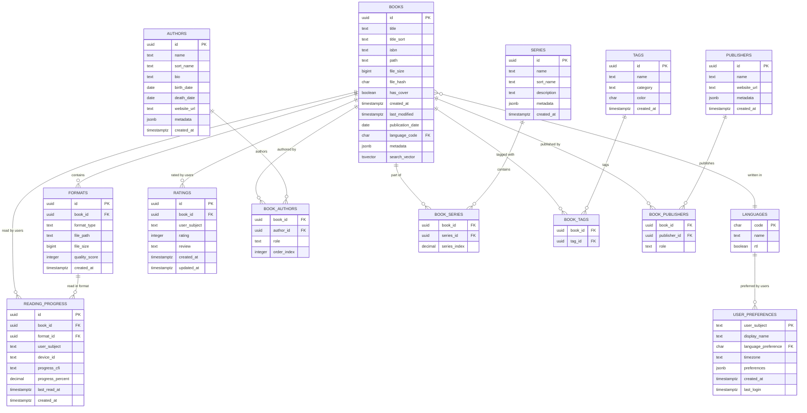

# Library Management System - PostgreSQL 16 ERD

## Overview

This ERD represents an optimized database schema for a modern library management system targeting PostgreSQL 16. The design is inspired by Calibre's proven schema but enhanced for web-scale performance, modern authentication, and cloud-native deployments.

## Design Principles

- **Performance First**: Optimized for libraries with 100k+ books
- **PostgreSQL 16 Native**: Leverages modern PostgreSQL features
- **OIDC Authentication**: No local user storage, relies on external identity providers
- **Scalability**: Designed for horizontal scaling and high concurrency
- **Extensibility**: JSONB fields for flexible metadata without schema changes

## Core Entities

### Books (Primary Entity)
```sql
CREATE TABLE books (
    id UUID PRIMARY KEY DEFAULT gen_random_uuid(),
    title TEXT NOT NULL,
    title_sort TEXT NOT NULL, -- Computed sort field for proper ordering
    isbn TEXT,
    path TEXT NOT NULL, -- Relative path from library root
    file_size BIGINT,
    file_hash CHAR(64), -- SHA-256 hash for deduplication
    has_cover BOOLEAN DEFAULT FALSE,
    created_at TIMESTAMPTZ DEFAULT NOW(),
    last_modified TIMESTAMPTZ DEFAULT NOW(),
    publication_date DATE,
    language_code CHAR(2) REFERENCES languages(code),
    metadata JSONB DEFAULT '{}', -- Flexible metadata storage
    search_vector TSVECTOR -- Full-text search
);

-- Optimized indexes
CREATE INDEX idx_books_title_sort ON books USING btree(title_sort);
CREATE INDEX idx_books_created_at ON books USING btree(created_at);
CREATE INDEX idx_books_language ON books USING btree(language_code);
CREATE INDEX idx_books_file_hash ON books USING hash(file_hash);
CREATE INDEX idx_books_search ON books USING gin(search_vector);
CREATE INDEX idx_books_metadata ON books USING gin(metadata);

-- Update search vector automatically
CREATE TRIGGER books_search_update 
    BEFORE INSERT OR UPDATE ON books
    FOR EACH ROW EXECUTE FUNCTION books_search_trigger();
```

### Authors
```sql
CREATE TABLE authors (
    id UUID PRIMARY KEY DEFAULT gen_random_uuid(),
    name TEXT NOT NULL,
    sort_name TEXT NOT NULL, -- For proper alphabetical sorting
    bio TEXT,
    birth_date DATE,
    death_date DATE,
    website_url TEXT,
    metadata JSONB DEFAULT '{}',
    created_at TIMESTAMPTZ DEFAULT NOW()
);

CREATE UNIQUE INDEX idx_authors_name ON authors(name);
CREATE INDEX idx_authors_sort ON authors USING btree(sort_name);
```

### Series
```sql
CREATE TABLE series (
    id UUID PRIMARY KEY DEFAULT gen_random_uuid(),
    name TEXT NOT NULL,
    sort_name TEXT NOT NULL,
    description TEXT,
    metadata JSONB DEFAULT '{}',
    created_at TIMESTAMPTZ DEFAULT NOW()
);

CREATE UNIQUE INDEX idx_series_name ON series(name);
CREATE INDEX idx_series_sort ON series USING btree(sort_name);
```

### Tags
```sql
CREATE TABLE tags (
    id UUID PRIMARY KEY DEFAULT gen_random_uuid(),
    name TEXT NOT NULL,
    category TEXT DEFAULT 'general', -- For grouping tags
    color CHAR(7), -- Hex color code
    created_at TIMESTAMPTZ DEFAULT NOW()
);

CREATE UNIQUE INDEX idx_tags_name ON tags(name);
CREATE INDEX idx_tags_category ON tags(category);
```

### Publishers
```sql
CREATE TABLE publishers (
    id UUID PRIMARY KEY DEFAULT gen_random_uuid(),
    name TEXT NOT NULL,
    website_url TEXT,
    metadata JSONB DEFAULT '{}',
    created_at TIMESTAMPTZ DEFAULT NOW()
);

CREATE UNIQUE INDEX idx_publishers_name ON publishers(name);
```

### Formats (File Types)
```sql
CREATE TABLE formats (
    id UUID PRIMARY KEY DEFAULT gen_random_uuid(),
    book_id UUID NOT NULL REFERENCES books(id) ON DELETE CASCADE,
    format_type TEXT NOT NULL, -- epub, pdf, mobi, etc.
    file_path TEXT NOT NULL,
    file_size BIGINT NOT NULL,
    quality_score INTEGER DEFAULT 0, -- For format preference
    created_at TIMESTAMPTZ DEFAULT NOW()
);

CREATE INDEX idx_formats_book ON formats(book_id);
CREATE INDEX idx_formats_type ON formats(format_type);
```

### Languages
```sql
CREATE TABLE languages (
    code CHAR(2) PRIMARY KEY, -- ISO 639-1 language codes
    name TEXT NOT NULL,
    rtl BOOLEAN DEFAULT FALSE -- Right-to-left reading direction
);

-- Pre-populate with common languages
INSERT INTO languages VALUES 
    ('en', 'English', FALSE),
    ('fr', 'French', FALSE),
    ('es', 'Spanish', FALSE),
    ('de', 'German', FALSE),
    ('ar', 'Arabic', TRUE);
```

### Ratings
```sql
CREATE TABLE ratings (
    id UUID PRIMARY KEY DEFAULT gen_random_uuid(),
    book_id UUID NOT NULL REFERENCES books(id) ON DELETE CASCADE,
    user_subject TEXT NOT NULL, -- OIDC subject identifier
    rating INTEGER CHECK (rating >= 1 AND rating <= 5),
    review TEXT,
    created_at TIMESTAMPTZ DEFAULT NOW(),
    updated_at TIMESTAMPTZ DEFAULT NOW()
);

CREATE INDEX idx_ratings_book ON ratings(book_id);
CREATE INDEX idx_ratings_user ON ratings(user_subject);
CREATE UNIQUE INDEX idx_ratings_book_user ON ratings(book_id, user_subject);
```

## Relationship Tables (Many-to-Many)

### Book-Author Relationships
```sql
CREATE TABLE book_authors (
    book_id UUID REFERENCES books(id) ON DELETE CASCADE,
    author_id UUID REFERENCES authors(id) ON DELETE CASCADE,
    role TEXT DEFAULT 'author', -- author, editor, translator, illustrator
    order_index INTEGER DEFAULT 0,
    PRIMARY KEY (book_id, author_id, role)
);

CREATE INDEX idx_book_authors_book ON book_authors(book_id);
CREATE INDEX idx_book_authors_author ON book_authors(author_id);
```

### Book-Series Relationships
```sql
CREATE TABLE book_series (
    book_id UUID REFERENCES books(id) ON DELETE CASCADE,
    series_id UUID REFERENCES series(id) ON DELETE CASCADE,
    series_index DECIMAL(10,2) DEFAULT 1.0,
    PRIMARY KEY (book_id, series_id)
);

CREATE INDEX idx_book_series_book ON book_series(book_id);
CREATE INDEX idx_book_series_series ON book_series(series_id);
CREATE INDEX idx_book_series_index ON book_series(series_index);
```

### Book-Tag Relationships
```sql
CREATE TABLE book_tags (
    book_id UUID REFERENCES books(id) ON DELETE CASCADE,
    tag_id UUID REFERENCES tags(id) ON DELETE CASCADE,
    PRIMARY KEY (book_id, tag_id)
);

CREATE INDEX idx_book_tags_book ON book_tags(book_id);
CREATE INDEX idx_book_tags_tag ON book_tags(tag_id);
```

### Book-Publisher Relationships
```sql
CREATE TABLE book_publishers (
    book_id UUID REFERENCES books(id) ON DELETE CASCADE,
    publisher_id UUID REFERENCES publishers(id) ON DELETE CASCADE,
    role TEXT DEFAULT 'publisher', -- publisher, distributor
    PRIMARY KEY (book_id, publisher_id, role)
);

CREATE INDEX idx_book_publishers_book ON book_publishers(book_id);
CREATE INDEX idx_book_publishers_publisher ON book_publishers(publisher_id);
```

## User Activity Tables

### Reading Progress (KOReader sync)
```sql
CREATE TABLE reading_progress (
    id UUID PRIMARY KEY DEFAULT gen_random_uuid(),
    book_id UUID NOT NULL REFERENCES books(id) ON DELETE CASCADE,
    format_id UUID REFERENCES formats(id) ON DELETE CASCADE,
    user_subject TEXT NOT NULL, -- OIDC subject
    device_id TEXT NOT NULL,
    progress_cfi TEXT, -- Canonical Fragment Identifier
    progress_percent DECIMAL(5,2) CHECK (progress_percent >= 0 AND progress_percent <= 100),
    last_read_at TIMESTAMPTZ NOT NULL DEFAULT NOW(),
    created_at TIMESTAMPTZ DEFAULT NOW()
);

CREATE INDEX idx_reading_progress_user ON reading_progress(user_subject);
CREATE INDEX idx_reading_progress_book ON reading_progress(book_id);
CREATE INDEX idx_reading_progress_last_read ON reading_progress(last_read_at);
CREATE UNIQUE INDEX idx_reading_progress_unique ON reading_progress(book_id, user_subject, device_id);

-- Partition by date for better performance
CREATE TABLE reading_progress_y2024 PARTITION OF reading_progress
    FOR VALUES FROM ('2024-01-01') TO ('2025-01-01');
```

### User Preferences
```sql
CREATE TABLE user_preferences (
    user_subject TEXT PRIMARY KEY, -- OIDC subject
    display_name TEXT,
    language_preference CHAR(2) REFERENCES languages(code),
    timezone TEXT DEFAULT 'UTC',
    preferences JSONB DEFAULT '{}', -- UI settings, reading preferences
    created_at TIMESTAMPTZ DEFAULT NOW(),
    last_login TIMESTAMPTZ DEFAULT NOW()
);

CREATE INDEX idx_user_preferences_last_login ON user_preferences(last_login);
```

### Download History
```sql
CREATE TABLE download_history (
    id UUID PRIMARY KEY DEFAULT gen_random_uuid(),
    book_id UUID NOT NULL REFERENCES books(id) ON DELETE CASCADE,
    format_id UUID REFERENCES formats(id) ON DELETE CASCADE,
    user_subject TEXT NOT NULL,
    ip_address INET,
    user_agent TEXT,
    downloaded_at TIMESTAMPTZ DEFAULT NOW()
);

CREATE INDEX idx_download_history_user ON download_history(user_subject);
CREATE INDEX idx_download_history_book ON download_history(book_id);
CREATE INDEX idx_download_history_date ON download_history(downloaded_at);

-- Partition by month for archival
CREATE TABLE download_history_y2024m01 PARTITION OF download_history
    FOR VALUES FROM ('2024-01-01') TO ('2024-02-01');
```

## System Tables

### Import Jobs
```sql
CREATE TABLE import_jobs (
    id UUID PRIMARY KEY DEFAULT gen_random_uuid(),
    status TEXT NOT NULL CHECK (status IN ('pending', 'running', 'completed', 'failed')),
    source_path TEXT NOT NULL,
    books_imported INTEGER DEFAULT 0,
    books_failed INTEGER DEFAULT 0,
    error_log TEXT,
    created_at TIMESTAMPTZ DEFAULT NOW(),
    started_at TIMESTAMPTZ,
    completed_at TIMESTAMPTZ
);

CREATE INDEX idx_import_jobs_status ON import_jobs(status);
CREATE INDEX idx_import_jobs_created ON import_jobs(created_at);
```

### System Configuration
```sql
CREATE TABLE system_config (
    key TEXT PRIMARY KEY,
    value TEXT NOT NULL,
    description TEXT,
    updated_at TIMESTAMPTZ DEFAULT NOW()
);

-- Default configuration
INSERT INTO system_config VALUES 
    ('library_path', '/data/library', 'Root path for book storage'),
    ('max_file_size', '100MB', 'Maximum upload file size'),
    ('allowed_formats', 'epub,pdf,mobi,azw3', 'Comma-separated list of allowed formats');
```

## Performance Optimizations

### Materialized Views for Common Queries
```sql
-- Book counts by author
CREATE MATERIALIZED VIEW author_book_counts AS
SELECT 
    a.id,
    a.name,
    COUNT(ba.book_id) as book_count
FROM authors a
LEFT JOIN book_authors ba ON a.id = ba.author_id
GROUP BY a.id, a.name;

CREATE UNIQUE INDEX idx_author_book_counts_id ON author_book_counts(id);

-- Refresh hourly
CREATE EXTENSION IF NOT EXISTS pg_cron;
SELECT cron.schedule('refresh-author-counts', '0 * * * *', 'REFRESH MATERIALIZED VIEW CONCURRENTLY author_book_counts;');
```

### Full-Text Search Function
```sql
CREATE OR REPLACE FUNCTION books_search_trigger() 
RETURNS TRIGGER AS $$
BEGIN
    NEW.search_vector := 
        setweight(to_tsvector('simple', COALESCE(NEW.title, '')), 'A') ||
        setweight(to_tsvector('simple', COALESCE(NEW.metadata->>'author', '')), 'B') ||
        setweight(to_tsvector('simple', COALESCE(NEW.metadata->>'description', '')), 'C');
    RETURN NEW;
END;
$$ LANGUAGE plpgsql;
```

### Advanced Search View
```sql
CREATE VIEW book_search AS
SELECT 
    b.id,
    b.title,
    b.title_sort,
    b.has_cover,
    b.publication_date,
    l.name as language_name,
    ARRAY_AGG(DISTINCT a.name) as author_names,
    ARRAY_AGG(DISTINCT s.name) as series_names,
    ARRAY_AGG(DISTINCT t.name) as tag_names,
    ARRAY_AGG(DISTINCT f.format_type) as available_formats,
    AVG(r.rating) as average_rating,
    COUNT(r.rating) as rating_count
FROM books b
LEFT JOIN languages l ON b.language_code = l.code
LEFT JOIN book_authors ba ON b.id = ba.book_id
LEFT JOIN authors a ON ba.author_id = a.id
LEFT JOIN book_series bs ON b.id = bs.book_id
LEFT JOIN series s ON bs.series_id = s.id
LEFT JOIN book_tags bt ON b.id = bt.book_id
LEFT JOIN tags t ON bt.tag_id = t.id
LEFT JOIN formats f ON b.id = f.book_id
LEFT JOIN ratings r ON b.id = r.book_id
GROUP BY b.id, b.title, b.title_sort, b.has_cover, b.publication_date, l.name;
```

## Mermaid ERD Diagram



## Migration Strategy

### Phase 1: Core Schema
1. Create core tables (books, authors, series, tags, publishers)
2. Create relationship tables
3. Add basic indexes
4. Set up full-text search

### Phase 2: User Features
1. Add reading progress tracking
2. Add user preferences
3. Add ratings and reviews
4. Set up partitioning for activity tables

### Phase 3: Performance Optimization
1. Create materialized views
2. Add advanced indexes (partial, functional)
3. Set up automated maintenance jobs
4. Configure query optimization

## Key Benefits

1. **Performance**: Optimized indexes and partitioning for 100k+ books
2. **Scalability**: UUID primary keys enable distributed systems
3. **Flexibility**: JSONB metadata allows schema evolution without migrations
4. **Modern Features**: Full-text search, reading sync, proper timestamp handling
5. **Security**: OIDC-based authentication, no local user storage
6. **Maintainability**: Clear separation of concerns, proper normalization
7. **PostgreSQL Native**: Leverages PostgreSQL 16 specific features

This schema provides a solid foundation for a modern, scalable library management system while maintaining the proven concepts from Calibre's mature design.