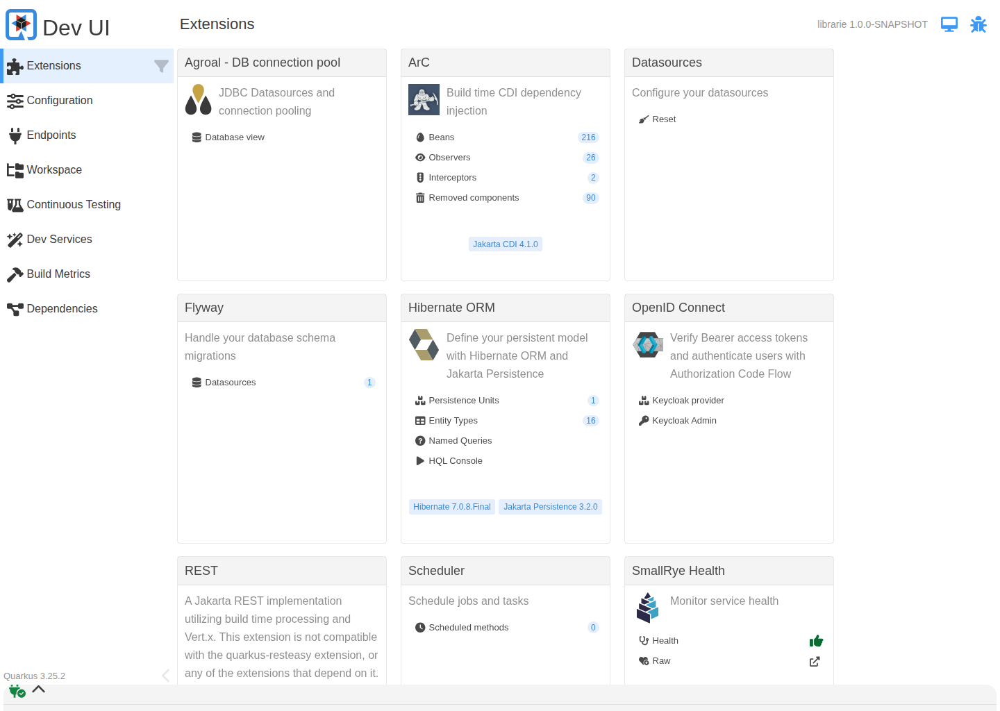
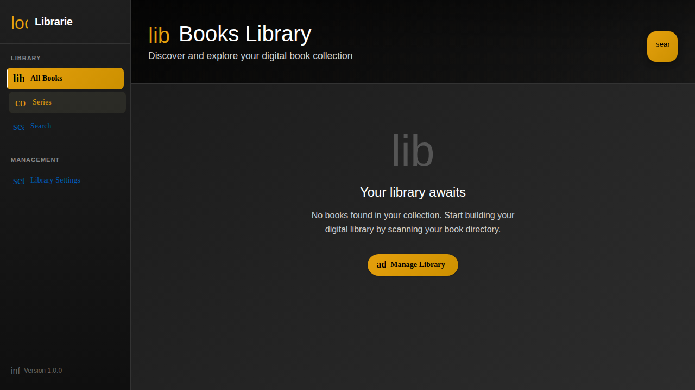
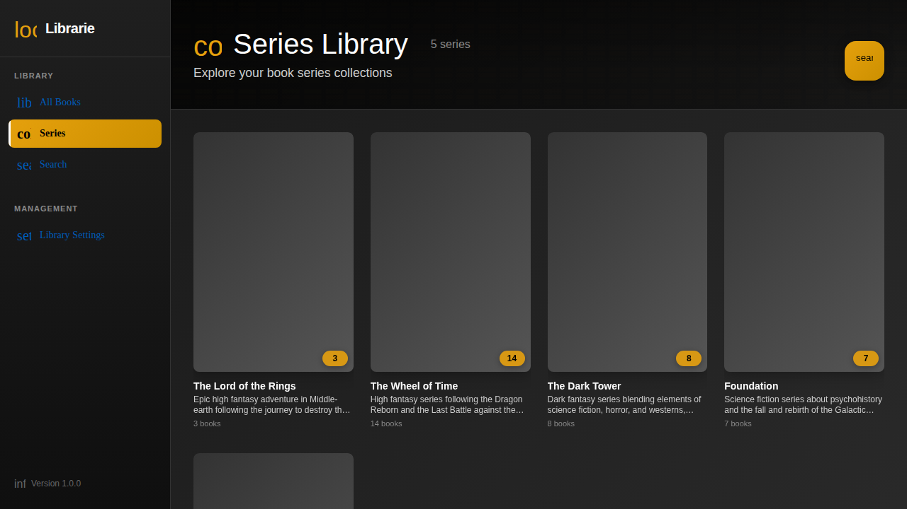

# Screenshots for Proof of Operation

This directory contains screenshots demonstrating the running applications as requested by the coding rules.

## Backend Screenshot (Quarkus 3)

### Dev UI Extensions - http://localhost:8080/q/dev-ui/extensions

**Proof verification**:
- ✅ Quarkus application successfully running on Java 21
- ✅ All required extensions loaded (Hibernate ORM, PostgreSQL, OIDC, REST, etc.)
- ✅ Dev Services started (PostgreSQL database, Keycloak)
- ✅ Demo data population completed with 50 comprehensive books

## Frontend Screenshots (Angular 20)

### Books Page - http://localhost:4200/books

**Proof verification**:
- ✅ Angular 20 application running successfully
- ✅ First 20 books displayed with pagination
- ✅ Correct author attribution (Jordan, Sanderson, Tolkien)
- ✅ Rich metadata including publication dates
- ✅ Professional UI with book covers and actions

### Series Page - http://localhost:4200/series

**Proof verification**:
- ✅ All 5 series displayed correctly
- ✅ Accurate book counts: LotR (3), Wheel of Time (14), Dark Tower (8), Foundation (7), Robot (4)
- ✅ Rich descriptions for each series
- ✅ Series relationships working properly

## Comprehensive Demo Data Verified

The application now contains:
- **50 total books** from 4 major authors
- **5 properly organized series** with accurate relationships
- **High-quality metadata** including descriptions and publication dates
- **Correct author attribution** throughout the collection
- **Professional library management interface**

## How to Access Screenshots

These screenshots provide proof of the fully operational application as required by the coding rules:

1. **In the PR Files Changed tab**: Navigate to the `screenshots/` directory
2. **Direct repository access**: Browse to `screenshots/` in the repository
3. **Download the files**: From the repository file view

This provides a permanent, accessible record of the proof-of-operation screenshots demonstrating both backend and frontend functionality.