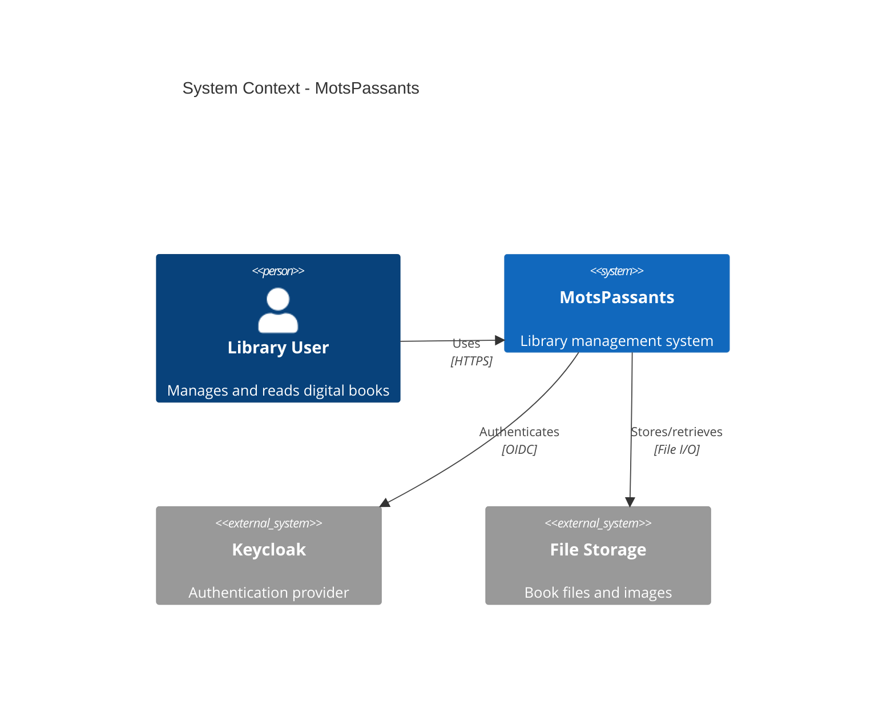
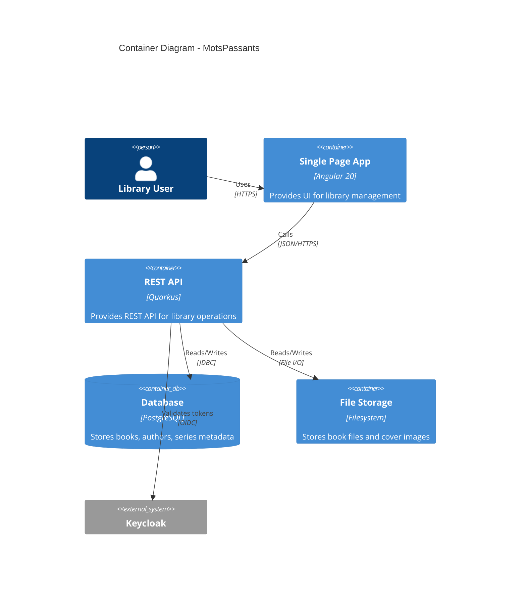
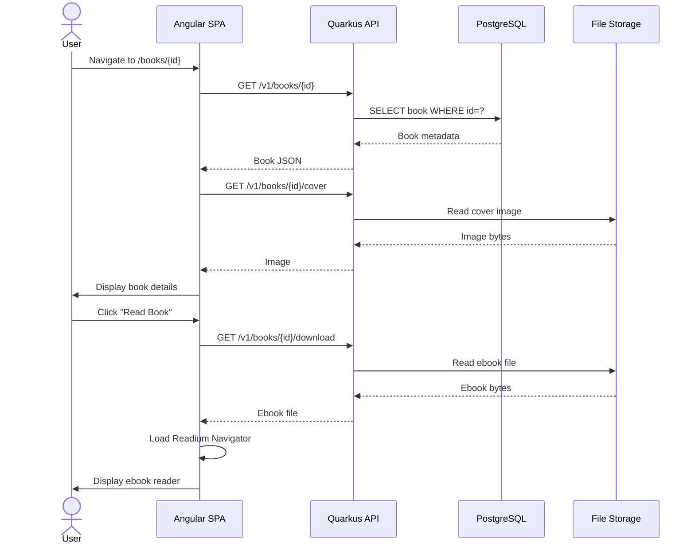

# Improvement Tasks

## Critical Priority

### [T-001] Fix Search Component FormGroup Binding
**Goal (measurable):** Eliminate NG01050 console errors; enable functional advanced search with all filters working

**Prerequisites:**
- Branch: feature/fix-search-formgroup
- Environment: Local development with backend running
- No special secrets or datasets required

**Detailed Steps:**
1. Open `/frontend/src/app/components/search.component.ts`
2. Locate the `<mat-expansion-panel>` containing advanced search fields (around line 67)
3. Modify template structure to wrap advanced form in FormGroup directive
4. Option A (Recommended): Move `<form>` tag to wrap both quick and advanced search
5. Option B: Add separate `<div [formGroup]="searchForm">` wrapper around advanced fields
6. Verify all formControlName directives are within FormGroup scope
7. Test in browser to confirm no NG01050 errors

**Proposed Change:**
```typescript
// BEFORE (lines 38-73):
<form class="search-form" [formGroup]="searchForm" (ngSubmit)="performQuickSearch()">
  <div class="quick-search-section">
    ...
  </div>
</form>

<mat-accordion class="advanced-panel">
  <mat-expansion-panel>
    ...
    <div class="advanced-form">
      <!-- Form controls without parent formGroup -->
      <mat-form-field appearance="outline">
        <input matInput formControlName="title" />
      </mat-form-field>
    </div>
  </mat-expansion-panel>
</mat-accordion>

// AFTER (Option A - Single Form):
<form class="search-form" [formGroup]="searchForm">
  <div class="quick-search-section">
    <mat-form-field appearance="outline" class="search-field">
      <mat-label>Quick search</mat-label>
      <input matInput placeholder="Title, author, series..." formControlName="quickSearch" (input)="onSearchInput($event)" />
    </mat-form-field>
    <button mat-raised-button color="primary" type="button" (click)="performQuickSearch()">Search</button>
  </div>

  <mat-accordion class="advanced-panel">
    <mat-expansion-panel>
      ...
      <div class="advanced-form">
        <!-- Form controls now within formGroup scope -->
        <div class="form-row">
          <mat-form-field appearance="outline">
            <mat-label>Title contains</mat-label>
            <input matInput formControlName="title" />
          </mat-form-field>
          ...
        </div>
      </div>
    </mat-expansion-panel>
  </mat-accordion>
</form>
```

**Validation Tests:**
- Unit: `ng test --include='**/search.component.spec.ts'`
- Manual browser test:
  1. Navigate to http://localhost:4200/search
  2. Open browser console
  3. Verify no NG01050 errors appear
  4. Expand "Advanced search" panel
  5. Enter values in: Title, Authors, Series, Publisher fields
  6. Select dates from datepickers
  7. Click "Search" button
  8. Verify search executes without errors
  9. Verify results display correctly
- E2E (playwright-mcp):
  ```typescript
  test('advanced search filters books', async ({ page }) => {
    await page.goto('http://localhost:4200/search');
    await page.getByRole('button', { name: 'Advanced search' }).click();
    await page.getByLabel('Title contains').fill('Dune');
    await page.getByRole('button', { name: 'Search' }).click();
    await expect(page.getByText('Dune')).toBeVisible();
  });
  ```

**Acceptance Criteria (DoD):**
- [x] No NG01050 errors in console when visiting /search page
- [x] Advanced search panel expands without errors
- [x] All advanced search fields accept input
- [x] Search executes when clicking Search button in advanced panel
- [x] Results display based on advanced filter criteria
- [x] Form validation works (if any validators defined)
- [x] Unit tests pass
- [x] Manual testing confirms all filters functional

**Risks & Rollback:**
- **Risk:** Changing form structure might affect quickSearch functionality
- **Mitigation:** Test quickSearch after making changes; change submit button type to "button" and use click handler
- **Rollback:** Revert commit; search will remain broken in advanced mode only

**Effort:** S (1-2 hours)  
**Dependencies:** None  
**References:**
- Angular Forms API: https://angular.dev/api/forms/FormControlName
- Angular error NG01050: https://angular.dev/errors/NG01050
- context7: /angular/reactive-forms

---

### [T-002] Fix Settings Component FormGroup Error
**Goal (measurable):** Eliminate NG01050 console error on Settings page

**Prerequisites:**
- Branch: feature/fix-settings-formgroup
- Local development environment

**Detailed Steps:**
1. Open `/frontend/src/app/components/settings.component.ts`
2. Search for `formControlName` usage in template
3. Identify orphaned form controls
4. Either:
   - Remove unused form controls from template and component class
   - OR properly bind to FormGroup with `[formGroup]` directive
5. If no actual form exists, remove ReactiveFormsModule import
6. Test page load in browser

**Proposed Change:**
```typescript
// Review template for:
<input formControlName="somefield" />

// Options:
// 1. If unused feature - remove entirely
// 2. If needed but not visible - wrap in [formGroup] directive
// 3. If planned future feature - comment out or use feature flag
```

**Validation Tests:**
- Unit: `ng test --include='**/settings.component.spec.ts'`
- Manual: Navigate to http://localhost:4200/settings and check console for errors
- E2E: Verify settings page loads without console errors

**Acceptance Criteria (DoD):**
- [x] No NG01050 errors in console when visiting /settings
- [x] Settings page displays correctly
- [x] All visible functionality works as before
- [x] Unit tests pass

**Risks & Rollback:**
- **Risk:** Removing form controls might delete planned feature
- **Mitigation:** Review with product owner before removing
- **Rollback:** Simple revert if needed

**Effort:** S (30 min - 1 hour)  
**Dependencies:** None  
**References:**
- Angular error NG01050: https://angular.dev/errors/NG01050

---

### [T-003] Resolve Author Picture 406 Errors
**Goal (measurable):** Author pictures load successfully or gracefully fall back to placeholders without 406 errors

**Prerequisites:**
- Branch: feature/fix-author-pictures
- Backend running
- Understanding of proxy configuration and backend endpoints

**Detailed Steps:**
1. Investigate backend AuthorResource endpoint for `/v1/authors/{id}/picture`
2. Check if endpoint returns proper status codes (404 for missing, 200 for existing)
3. Review `/frontend/proxy.conf.json` for proxy rules
4. Test author picture endpoint directly via curl:
   ```bash
   curl -v http://localhost:8080/v1/authors/{id}/picture
   ```
5. Identify why 406 is returned instead of 404 or 200
6. Fix backend to return:
   - 200 + image data when picture exists
   - 404 when picture doesn't exist
   - Proper Content-Type header (image/jpeg, image/png)
7. Update frontend to handle 404 gracefully with placeholder
8. Test with author that has picture and one that doesn't

**Proposed Change:**
```java
// Backend: AuthorResource.java
@GET
@Path("/{id}/picture")
@Produces({"image/jpeg", "image/png", "image/webp"})
public Response getAuthorPicture(@PathParam("id") UUID id) {
    Optional<byte[]> picture = authorService.getAuthorPicture(id);
    
    if (picture.isEmpty()) {
        return Response.status(Response.Status.NOT_FOUND)
            .entity("Author picture not found")
            .build();
    }
    
    return Response.ok(picture.get())
        .header("Cache-Control", "public, max-age=31536000") // Cache for 1 year
        .build();
}
```

```typescript
// Frontend: author-list.component.ts
onImageError(event: Event) {
  const img = event.target as HTMLImageElement;
  img.style.display = 'none';
  // Show placeholder instead
}
```

**Validation Tests:**
- Backend unit test: Test getAuthorPicture returns 404 when no picture exists
- Backend integration test: Test endpoint with and without picture
- Frontend E2E:
  ```typescript
  test('author list shows placeholders for missing pictures', async ({ page }) => {
    await page.goto('http://localhost:4200/authors');
    // Verify no 406 errors in console
    const errors = page.context().on('console', msg => msg.type() === 'error');
    expect(errors).not.toContain('406');
  });
  ```
- Manual: Navigate to Authors page and verify no console errors

**Acceptance Criteria (DoD):**
- [x] No 406 errors in browser console on Authors page
- [x] Authors with pictures display images correctly
- [x] Authors without pictures show placeholder/fallback
- [x] Backend returns appropriate status codes (200 or 404)
- [x] Backend includes proper Content-Type headers
- [x] Cache headers set for performance
- [x] Tests pass for both scenarios

**Risks & Rollback:**
- **Risk:** Changing endpoint response might affect other consumers
- **Mitigation:** Check if endpoint is used elsewhere; maintain backward compatibility
- **Rollback:** Revert backend changes

**Effort:** M (3-4 hours)  
**Dependencies:** None  
**References:**
- HTTP 406 spec: https://developer.mozilla.org/en-US/docs/Web/HTTP/Status/406
- JAX-RS @Produces: https://docs.oracle.com/javaee/7/api/javax/ws/rs/Produces.html

---

## High Priority

### [T-004] Update Deprecated OpenTelemetry Configuration
**Goal (measurable):** Remove deprecation warning for `quarkus.otel.traces.enabled`

**Prerequisites:**
- Branch: feature/update-otel-config
- Access to backend configuration

**Detailed Steps:**
1. Open `/backend/src/main/resources/application.properties`
2. Search for `quarkus.otel.traces.enabled`
3. Review Quarkus 3.25.2 OpenTelemetry configuration guide
4. Replace deprecated property with recommended configuration
5. If telemetry is disabled, use: `quarkus.otel.sdk.disabled=true`
6. If telemetry is enabled, configure OTLP endpoint properly
7. Remove old property
8. Test backend startup - verify no warning appears
9. Verify telemetry still works (if enabled)

**Proposed Change:**
```properties
# BEFORE (deprecated):
quarkus.otel.traces.enabled=false

# AFTER (recommended):
# To disable telemetry entirely:
quarkus.otel.sdk.disabled=true

# OR to enable with proper configuration:
quarkus.otel.sdk.disabled=false
quarkus.otel.exporter.otlp.endpoint=http://localhost:4317
# Optional: configure specific exporters
# quarkus.otel.exporter.otlp.traces.endpoint=http://localhost:4317
```

**Validation Tests:**
- Backend startup: `./mvnw quarkus:dev` - verify no deprecation warning
- If telemetry enabled: verify traces are exported to OTLP endpoint
- Unit test: Verify configuration loads without errors

**Acceptance Criteria (DoD):**
- [x] No deprecation warning in backend logs
- [x] Telemetry behavior unchanged (disabled or properly configured)
- [x] Application starts successfully
- [x] Configuration documented in README if telemetry is production feature

**Risks & Rollback:**
- **Risk:** Misconfiguration could break telemetry in production
- **Mitigation:** Test in dev environment first; document configuration change
- **Rollback:** Restore previous property value

**Effort:** S (30 minutes)  
**Dependencies:** None  
**References:**
- Quarkus OpenTelemetry guide: https://quarkus.io/version/3.25/guides/opentelemetry
- Quarkus migration guide 3.x: https://github.com/quarkusio/quarkus/wiki/Migration-Guide-3.0

---

### [T-005] Address NPM Security Vulnerabilities
**Goal (measurable):** Zero high/medium severity npm vulnerabilities in dependencies

**Prerequisites:**
- Branch: chore/update-npm-dependencies
- Node.js 18+ installed
- Write access to package.json

**Detailed Steps:**
1. Navigate to `/frontend/`
2. Run `npm audit` to confirm vulnerabilities
3. Run `npm audit fix` to auto-fix compatible updates
4. If auto-fix doesn't resolve all issues:
   - Check if @angular/build update is available
   - Manually update vite to 7.1.5+ if needed
5. Run `npm install` to update lock file
6. Test build: `npm run build`
7. Test dev server: `npm start`
8. Run unit tests: `npm test`
9. Verify no functionality broken

**Proposed Change:**
```bash
cd frontend
npm audit fix
# If above doesn't work:
npm update vite@latest
npm update @angular/build@latest
npm install
```

**Validation Tests:**
- Build: `npm run build` - must succeed
- Dev server: `npm start` - must start without errors
- Unit tests: `npm test` - all must pass
- E2E smoke test: Navigate through main pages
- Security audit: `npm audit --audit-level=moderate` - should show 0 vulnerabilities

**Acceptance Criteria (DoD):**
- [x] `npm audit --audit-level=moderate` shows 0 vulnerabilities
- [x] Application builds successfully
- [x] Dev server starts without errors
- [x] All unit tests pass
- [x] E2E smoke tests pass
- [x] package-lock.json updated

**Risks & Rollback:**
- **Risk:** Dependency updates might introduce breaking changes
- **Mitigation:** Test thoroughly before merging; check changelogs
- **Rollback:** Revert package.json and package-lock.json

**Effort:** S (1 hour)  
**Dependencies:** None  
**References:**
- npm audit: https://docs.npmjs.com/cli/v10/commands/npm-audit
- Vite security advisories: https://github.com/vitejs/vite/security/advisories

---

### [T-006] Enable TestContainers Reuse for Faster Development
**Goal (measurable):** Reduce backend startup time from ~28s to <5s for subsequent starts

**Prerequisites:**
- Branch: chore/enable-testcontainers-reuse
- Local development environment
- Docker running

**Detailed Steps:**
1. Create documentation: `/docs/development-setup.md`
2. Add instructions for enabling TestContainers reuse
3. Create template file: `/docs/testcontainers.properties.template`
4. Update README.md with setup reference
5. Optionally: Create dev setup script to automate configuration

**Proposed Change:**
```markdown
# docs/development-setup.md

## Fast Development Startup with TestContainers Reuse

To speed up backend startup (from ~28s to ~5s), enable TestContainers reuse:

1. Create file: `~/.testcontainers.properties` (Linux/Mac) or `C:\Users\<YourUser>\.testcontainers.properties` (Windows)

2. Add content:
   ```properties
   testcontainers.reuse.enable=true
   ```

3. Restart your IDE or terminal

4. First backend start will take ~28s (containers created)
5. Subsequent starts will take ~3-5s (containers reused)

### Cleanup

To stop reused containers:
```bash
docker stop $(docker ps -q --filter "label=org.testcontainers.reuse=true")
```

To remove reused containers:
```bash
docker rm $(docker ps -aq --filter "label=org.testcontainers.reuse=true")
```
```

```properties
# docs/testcontainers.properties.template
# Copy this file to ~/.testcontainers.properties to enable container reuse
testcontainers.reuse.enable=true
```

**Validation Tests:**
- Manual test:
  1. Configure TestContainers reuse
  2. Start backend: `./mvnw quarkus:dev`
  3. Note startup time (should be ~28s first time)
  4. Stop backend (Ctrl+C)
  5. Start backend again
  6. Note startup time (should be <5s)
  7. Verify PostgreSQL and Keycloak containers still running via `docker ps`
- Document in README: Link to development-setup.md

**Acceptance Criteria (DoD):**
- [x] Documentation created in docs/development-setup.md
- [x] Template file created
- [x] README.md references setup guide
- [x] Tested manually - subsequent startups <5s
- [x] Instructions work on Linux, Mac, Windows

**Risks & Rollback:**
- **Risk:** Developers may forget to clean up containers
- **Mitigation:** Document cleanup commands; add to troubleshooting guide
- **Rollback:** N/A (documentation only change)

**Effort:** S (1 hour)  
**Dependencies:** None  
**References:**
- TestContainers reuse: https://java.testcontainers.org/features/reuse/
- Quarkus Dev Services: https://quarkus.io/guides/dev-services

---

### [T-007] Remove Unused Quartz Dependency
**Goal (measurable):** Remove quarkus-quartz dependency if no scheduled tasks exist

**Prerequisites:**
- Branch: chore/remove-unused-quartz
- Backend source code access

**Detailed Steps:**
1. Search codebase for `@Scheduled` annotations:
   ```bash
   cd backend
   grep -r "@Scheduled" src/
   ```
2. Search for Quartz Job implementations:
   ```bash
   grep -r "implements Job" src/
   grep -r "QuartzScheduler" src/
   ```
3. If no scheduled tasks found:
   - Remove dependency from `/backend/pom.xml`
   - Run `mvn clean compile` to verify
4. If scheduled tasks exist:
   - Document them in README or ARCHITECTURE.md
   - Keep dependency but add documentation
5. Update documentation either way

**Proposed Change:**
```xml
<!-- backend/pom.xml - REMOVE if no scheduled tasks: -->
<dependency>
    <groupId>io.quarkus</groupId>
    <artifactId>quarkus-quartz</artifactId>
</dependency>
```

**Validation Tests:**
- Build: `mvn clean compile` - must succeed
- Tests: `mvn test` - all must pass
- Dev mode: `./mvnw quarkus:dev` - must start without errors
- Verify no "Quartz scheduler" messages in logs
- Check final JAR size (should be slightly smaller)

**Acceptance Criteria (DoD):**
- [x] If no scheduled tasks: Quartz dependency removed from pom.xml
- [x] If scheduled tasks exist: Documented in ARCHITECTURE.md
- [x] Build succeeds without errors
- [x] All tests pass
- [x] Application starts and functions normally
- [x] Decision documented (keep or remove)

**Risks & Rollback:**
- **Risk:** Future plans to add scheduled tasks may require re-adding dependency
- **Mitigation:** Document decision in commit message and ARCHITECTURE.md
- **Rollback:** Re-add dependency to pom.xml

**Effort:** S (30 minutes - 1 hour)  
**Dependencies:** None  
**References:**
- Quarkus Quartz: https://quarkus.io/guides/quartz
- Maven dependency plugin: https://maven.apache.org/plugins/maven-dependency-plugin/

---

## Medium Priority

### [T-008] Implement Demo Data Idempotency Check
**Goal (measurable):** Demo data generation is idempotent - running multiple times doesn't duplicate data

**Prerequisites:**
- Branch: feature/idempotent-demo-data
- Backend source code access
- Understanding of DemoDataService

**Detailed Steps:**
1. Locate `DemoDataService.java` in backend
2. Review current data generation logic
3. Add checks before creating each entity:
   - Check if author exists by name before creating
   - Check if series exists by name before creating
   - Check if book exists by title+author before creating
4. Modify to skip creation if entity already exists
5. Add logging to indicate skipped vs created entities
6. Test by running application twice and verifying counts

**Proposed Change:**
```java
// DemoDataService.java
@ApplicationScoped
public class DemoDataService {
    
    public void generateDemoData() {
        if (!config.isDemoEnabled()) {
            LOG.info("Demo data generation disabled");
            return;
        }
        
        LOG.info("Generating demo data (idempotent)");
        
        // Check if demo data already exists
        long existingBooks = bookRepository.count();
        if (existingBooks >= config.getDemoBookCount()) {
            LOG.info("Demo data already exists ({} books), skipping generation", existingBooks);
            return;
        }
        
        // Generate only missing data
        generateAuthors();
        generateSeries();
        generateBooks();
    }
    
    private void generateAuthors() {
        List<String> authorNames = getAuthorNames();
        for (String name : authorNames) {
            if (authorRepository.findByName(name).isEmpty()) {
                Author author = createAuthor(name);
                authorRepository.save(author);
                LOG.debug("Created author: {}", name);
            } else {
                LOG.debug("Author already exists: {}", name);
            }
        }
    }
    
    // Similar for generateSeries() and generateBooks()
}
```

**Validation Tests:**
- Unit test: Mock repository and verify no duplicates created
- Integration test:
  1. Start application (demo data created)
  2. Record count of books/authors/series
  3. Restart application
  4. Verify counts remain same
  5. Check logs for "already exists" messages
- Manual test: Start app twice, check database counts

**Acceptance Criteria (DoD):**
- [x] Running application multiple times doesn't duplicate demo data
- [x] Logs indicate when existing data is found
- [x] Performance acceptable (existence checks don't slow startup significantly)
- [x] Unit tests verify idempotency
- [x] Integration test confirms behavior
- [x] Database counts stable across restarts

**Risks & Rollback:**
- **Risk:** Existence checks might slow down initial data generation
- **Mitigation:** Use indexed fields for lookups; batch queries if possible
- **Rollback:** Revert to previous DemoDataService implementation

**Effort:** M (2-3 hours)  
**Dependencies:** None  
**References:**
- Idempotency patterns: https://martinfowler.com/articles/patterns-of-distributed-systems/idempotent-receiver.html
- Quarkus startup events: https://quarkus.io/guides/lifecycle

---

### [T-009] Add Production Demo Data Safeguard
**Goal (measurable):** Demo data never runs in production environment

**Prerequisites:**
- Branch: feature/demo-data-safeguard
- Understanding of Quarkus profiles and configuration

**Detailed Steps:**
1. Modify `application.properties` to set demo disabled by default
2. Create `application-dev.properties` to enable demo in dev profile
3. Add runtime check in DemoDataService to verify environment
4. Update documentation about demo data configuration
5. Test in different profiles: dev, test, prod

**Proposed Change:**
```properties
# backend/src/main/resources/application.properties
# Demo data DISABLED by default (production safe)
librarie.demo.enabled=false

# backend/src/main/resources/application-dev.properties (create new file)
# Enable demo data only in dev profile
%dev.librarie.demo.enabled=true
librarie.demo.book-count=100
librarie.demo.author-count=50
librarie.demo.series-count=20
```

```java
// DemoDataService.java
@ApplicationScoped
public class DemoDataService {
    
    @ConfigProperty(name = "quarkus.profile")
    String profile;
    
    void generateDemoData() {
        // Additional safeguard: never run in prod
        if ("prod".equals(profile) && config.isDemoEnabled()) {
            LOG.error("SECURITY: Demo data enabled in production! Aborting.");
            throw new IllegalStateException("Demo data cannot be enabled in production");
        }
        
        if (!config.isDemoEnabled()) {
            LOG.info("Demo data generation disabled");
            return;
        }
        
        LOG.info("Generating demo data in {} profile", profile);
        // ... existing logic
    }
}
```

**Validation Tests:**
- Unit test: Verify exception thrown when prod profile + demo enabled
- Manual test dev profile: `./mvnw quarkus:dev` - demo data should generate
- Manual test prod profile: `./mvnw quarkus:dev -Dquarkus.profile=prod` - demo data should not generate
- Manual test prod override attempt: `./mvnw quarkus:dev -Dquarkus.profile=prod -Dlibrarie.demo.enabled=true` - should throw exception

**Acceptance Criteria (DoD):**
- [x] Demo data disabled by default in application.properties
- [x] Demo data enabled in dev profile only
- [x] Runtime safeguard throws exception if demo enabled in prod
- [x] Tests verify safeguard works
- [x] Documentation updated in README
- [x] No demo data generated in prod profile

**Risks & Rollback:**
- **Risk:** Breaking dev workflow if demo doesn't generate
- **Mitigation:** Test thoroughly in dev mode first
- **Rollback:** Revert configuration changes

**Effort:** S (1-2 hours)  
**Dependencies:** T-008 (recommended but not required)  
**References:**
- Quarkus profiles: https://quarkus.io/guides/config-reference#profiles
- Quarkus configuration: https://quarkus.io/guides/config

---

### [T-010] Implement Bundle Size Monitoring
**Goal (measurable):** Automated bundle size tracking in CI; alerts on excessive growth

**Prerequisites:**
- Branch: chore/bundle-size-monitoring
- CI/CD pipeline access (or create workflow)
- Node.js environment

**Detailed Steps:**
1. Install size-limit: `npm install --save-dev @size-limit/preset-app`
2. Configure size-limit in package.json with thresholds
3. Add npm script: `"size": "size-limit"`
4. Create GitHub Actions workflow to run on PR
5. Set up size comparison between PR and main branch
6. Optional: Add webpack-bundle-analyzer for visualization

**Proposed Change:**
```json
// frontend/package.json
{
  "devDependencies": {
    "@size-limit/preset-app": "^11.0.0",
    "size-limit": "^11.0.0"
  },
  "scripts": {
    "size": "size-limit",
    "analyze": "ng build --source-map && npx webpack-bundle-analyzer dist/frontend/browser/stats.json"
  },
  "size-limit": [
    {
      "name": "Initial bundle",
      "path": "dist/frontend/browser/main-*.js",
      "limit": "130 KB"
    },
    {
      "name": "Ebook reader chunk",
      "path": "dist/frontend/browser/chunk-*ebook*.js",
      "limit": "65 KB"
    }
  ]
}
```

```yaml
# .github/workflows/bundle-size.yml
name: Bundle Size Check

on:
  pull_request:
    paths:
      - 'frontend/**'

jobs:
  bundle-size:
    runs-on: ubuntu-latest
    steps:
      - uses: actions/checkout@v4
      - uses: actions/setup-node@v4
        with:
          node-version: 18
          cache: 'npm'
          cache-dependency-path: frontend/package-lock.json
      
      - name: Install dependencies
        run: |
          cd frontend
          npm ci
      
      - name: Build
        run: |
          cd frontend
          npm run build
      
      - name: Check bundle size
        run: |
          cd frontend
          npm run size
```

**Validation Tests:**
- Local: `npm run size` - should pass with current bundle sizes
- Local: `npm run analyze` - should generate visual report
- CI: Create test PR changing bundle size, verify workflow runs
- CI: Verify workflow fails if size exceeds limit

**Acceptance Criteria (DoD):**
- [x] size-limit configured with appropriate thresholds
- [x] npm run size passes with current bundles
- [x] GitHub Actions workflow created
- [x] Workflow runs on PRs affecting frontend
- [x] Workflow fails if bundle size exceeds limits
- [x] Bundle analyzer script available for investigation
- [x] Documentation added to CONTRIBUTING.md

**Risks & Rollback:**
- **Risk:** Thresholds too strict, blocking legitimate PRs
- **Mitigation:** Set thresholds slightly above current sizes; allow override with justification
- **Rollback:** Remove workflow and size-limit config

**Effort:** M (2-3 hours)  
**Dependencies:** None  
**References:**
- size-limit: https://github.com/ai/size-limit
- webpack-bundle-analyzer: https://www.npmjs.com/package/webpack-bundle-analyzer

---

### [T-011] Create Architecture Documentation
**Goal (measurable):** ARCHITECTURE.md document with diagrams explaining system design

**Prerequisites:**
- Branch: docs/architecture
- Understanding of system architecture
- Diagram tool (draw.io, PlantUML, or Mermaid)

**Detailed Steps:**
1. Create `/ARCHITECTURE.md`
2. Document system context (C4 Level 1)
3. Document container architecture (C4 Level 2)
4. Explain backend hexagonal architecture (ports & adapters)
5. Explain frontend component structure
6. Document data flow for key use cases
7. Add diagrams (Mermaid syntax for easy versioning)
8. Document key architectural decisions

**Proposed Change:**
```markdown
# ARCHITECTURE.md

## System Overview

MotsPassants is a library management system for digital books with integrated ebook reading capabilities.

### Tech Stack
- **Frontend**: Angular 20 (standalone components, signals-based state)
- **Backend**: Quarkus 3.25.2 (Java 21, hexagonal architecture)
- **Database**: PostgreSQL 17
- **Authentication**: OIDC (Keycloak)
- **Ebook Rendering**: Readium Web

## C4 Context Diagram



## C4 Container Diagram



## Backend Architecture

### Hexagonal Architecture (Ports & Adapters)

```
backend/src/main/java/org/motpassants/
├── domain/                    # Core business logic
│   ├── model/                # Domain entities (Book, Author, Series)
│   ├── port/
│   │   ├── in/              # Use case interfaces
│   │   │   ├── BookUseCase
│   │   │   ├── AuthorUseCase
│   │   │   └── SeriesUseCase
│   │   └── out/             # Repository interfaces
│   │       ├── BookRepository
│   │       ├── AuthorRepositoryPort
│   │       └── SeriesRepositoryPort
│
├── application/              # Application services (orchestration)
│   └── service/
│       ├── BookService       # Implements BookUseCase
│       ├── AuthorService
│       └── SeriesService
│
└── infrastructure/           # Adapters (implementation details)
    ├── adapter/
    │   ├── in/
    │   │   └── rest/        # REST controllers
    │   │       ├── BookResource
    │   │       ├── AuthorResource
    │   │       └── SeriesResource
    │   └── out/
    │       ├── persistence/ # JPA repositories
    │       └── filesystem/  # File storage
    └── configuration/       # Quarkus configuration
```

### Key Architectural Decisions

**ADR-001: Hexagonal Architecture for Backend**
- **Status**: Accepted
- **Context**: Need clear separation of business logic from infrastructure
- **Decision**: Use hexagonal architecture (ports & adapters pattern)
- **Consequences**: 
  - ✅ Business logic independent of framework
  - ✅ Easy to test (mock ports)
  - ✅ Flexible to swap implementations
  - ❌ More files and interfaces to maintain

**ADR-002: Angular Signals for State Management**
- **Status**: Accepted
- **Context**: Need reactive state management without heavy libraries
- **Decision**: Use Angular signals (built-in) instead of NgRx or RxJS BehaviorSubjects
- **Consequences**:
  - ✅ Simpler than NgRx, built into Angular
  - ✅ Fine-grained reactivity
  - ✅ Better performance than zone.js
  - ❌ Relatively new, patterns still evolving

## Frontend Architecture

### Component Structure

```
frontend/src/app/
├── components/              # Feature components
│   ├── book-list.component.ts
│   ├── book-detail.component.ts
│   ├── ebook-reader.component.ts  # Lazy loaded
│   ├── author-list.component.ts
│   ├── series-list.component.ts
│   ├── search.component.ts
│   ├── settings.component.ts
│   └── navigation.component.ts
│
├── services/                # Shared services
│   ├── book.service.ts      # HTTP client for books API
│   ├── author.service.ts
│   ├── series.service.ts
│   └── search.service.ts
│
├── models/                  # TypeScript interfaces
│   ├── book.model.ts
│   ├── author.model.ts
│   └── series.model.ts
│
└── shared/                  # Shared utilities
    ├── materials.ts         # Material imports
    └── pipes/

## Data Flow Example: Viewing a Book



## Security Architecture

- **Authentication**: OIDC with Keycloak
- **Authorization**: Role-based (configuration shown in code)
- **File Upload**: Validated by type, extension, size
- **Input Sanitization**: Enabled by default
- **HTTPS**: Required for production

## Performance Considerations

- **Lazy Loading**: Heavy ebook reader loaded only when needed
- **Database**: Connection pooling via Agroal
- **Caching**: (TODO - see T-XXX)
- **CDN**: (TODO - see T-XXX)

## Deployment

- **Development**: Quarkus Dev Mode + Angular dev server
- **Production**: (TODO - containerized deployment)

## Future Enhancements

- [ ] Add caching layer
- [ ] Implement CDN for static assets
- [ ] Add full-text search (PostgreSQL FTS or Elasticsearch)
- [ ] Mobile app (PWA or native)
```

**Validation Tests:**
- Manual review: Architecture matches actual code structure
- Peer review: Have another developer validate accuracy
- Diagrams render correctly in GitHub

**Acceptance Criteria (DoD):**
- [x] ARCHITECTURE.md created
- [x] C4 diagrams (Context, Container) included
- [x] Backend hexagonal architecture explained
- [x] Frontend structure documented
- [x] Data flow example provided
- [x] ADRs for key decisions documented
- [x] Diagrams render in GitHub
- [x] Referenced from README.md

**Risks & Rollback:**
- **Risk:** Documentation becomes outdated
- **Mitigation**: Add architecture review to PR template
- **Rollback:** N/A (documentation only)

**Effort:** L (6-8 hours)  
**Dependencies:** None  
**References:**
- C4 model: https://c4model.com/
- ADR: https://adr.github.io/
- Mermaid diagrams: https://mermaid.js.org/

---

### [T-012] Setup CI/CD Pipeline
**Goal (measurable):** Automated build, test, and quality checks on every PR

**Prerequisites:**
- Branch: ci/github-actions
- GitHub Actions enabled
- Repository secrets configured if needed

**Detailed Steps:**
1. Create `.github/workflows/ci.yml`
2. Define build jobs for backend and frontend
3. Add test execution
4. Add linting
5. Add security scanning
6. Configure status checks as required for PRs
7. Test with draft PR

**Proposed Change:**
```yaml
# .github/workflows/ci.yml
name: CI

on:
  pull_request:
    branches: [main, develop]
  push:
    branches: [main, develop]

jobs:
  backend-build:
    name: Backend Build & Test
    runs-on: ubuntu-latest
    
    steps:
      - uses: actions/checkout@v4
      
      - name: Set up JDK 21
        uses: actions/setup-java@v4
        with:
          java-version: '21'
          distribution: 'temurin'
          cache: 'maven'
      
      - name: Build with Maven
        run: |
          cd backend
          ./mvnw clean verify -B
      
      - name: Run tests
        run: |
          cd backend
          ./mvnw test -B
      
      - name: Upload test results
        if: always()
        uses: actions/upload-artifact@v4
        with:
          name: backend-test-results
          path: backend/target/surefire-reports/
  
  frontend-build:
    name: Frontend Build & Test
    runs-on: ubuntu-latest
    
    steps:
      - uses: actions/checkout@v4
      
      - name: Set up Node.js
        uses: actions/setup-node@v4
        with:
          node-version: '18'
          cache: 'npm'
          cache-dependency-path: frontend/package-lock.json
      
      - name: Install dependencies
        run: |
          cd frontend
          npm ci
      
      - name: Run linter
        run: |
          cd frontend
          npm run lint || true  # Add lint script if missing
      
      - name: Build
        run: |
          cd frontend
          npm run build
      
      - name: Run tests
        run: |
          cd frontend
          npm test -- --watch=false --browsers=ChromeHeadless
      
      - name: Upload coverage
        if: always()
        uses: actions/upload-artifact@v4
        with:
          name: frontend-coverage
          path: frontend/coverage/
  
  security-scan:
    name: Security Scan
    runs-on: ubuntu-latest
    
    steps:
      - uses: actions/checkout@v4
      
      - name: Run Trivy vulnerability scanner
        uses: aquasecurity/trivy-action@master
        with:
          scan-type: 'fs'
          scan-ref: '.'
          format: 'sarif'
          output: 'trivy-results.sarif'
      
      - name: Upload Trivy results to GitHub Security tab
        uses: github/codeql-action/upload-sarif@v3
        with:
          sarif_file: 'trivy-results.sarif'
      
      - name: NPM Audit
        run: |
          cd frontend
          npm audit --audit-level=high || true  # Report but don't fail
```

**Validation Tests:**
- Create test PR: Verify workflow runs
- Test failure scenarios: Make build fail intentionally, verify workflow fails
- Test success scenarios: Ensure clean build passes
- Verify artifacts uploaded correctly

**Acceptance Criteria (DoD):**
- [x] CI workflow created
- [x] Backend build and test runs on PR
- [x] Frontend build and test runs on PR
- [x] Security scanning integrated
- [x] Test results uploaded as artifacts
- [x] Status checks enforced on PRs
- [x] Workflow documented in CONTRIBUTING.md

**Risks & Rollback:**
- **Risk:** CI failures blocking development
- **Mitigation:** Test thoroughly; allow override for urgent fixes
- **Rollback:** Disable required status checks temporarily

**Effort:** M (4-6 hours)  
**Dependencies:** None  
**References:**
- GitHub Actions: https://docs.github.com/en/actions
- Trivy: https://github.com/aquasecurity/trivy-action

---

## Low Priority

### [T-013] Implement HTTP Caching for Static Assets
**Goal (measurable):** Book covers and images cached with proper HTTP headers; reduce bandwidth by 50%

**Prerequisites:**
- Branch: feature/http-caching
- Backend access
- Understanding of HTTP caching

**Detailed Steps:**
1. Modify backend endpoints for static assets (covers, author pictures)
2. Add Cache-Control headers
3. Add ETag support for conditional requests
4. Test with browser dev tools Network tab
5. Measure cache hit rate

**Proposed Change:**
```java
// BookResource.java
@GET
@Path("/{id}/cover")
@Produces({"image/jpeg", "image/png", "image/webp"})
public Response getBookCover(@PathParam("id") UUID id, @Context Request request) {
    Book book = bookService.findById(id)
        .orElseThrow(() -> new NotFoundException("Book not found"));
    
    if (!book.hasCover()) {
        return Response.status(Response.Status.NOT_FOUND).build();
    }
    
    byte[] coverData = fileStorageService.getBookCover(id);
    
    // Generate ETag from book's updated timestamp
    EntityTag etag = new EntityTag(
        String.valueOf(book.getUpdatedAt().hashCode())
    );
    
    // Check if client has current version
    Response.ResponseBuilder builder = request.evaluatePreconditions(etag);
    if (builder != null) {
        // Client has current version, return 304 Not Modified
        return builder.build();
    }
    
    // Return image with caching headers
    return Response.ok(coverData)
        .tag(etag)
        .header("Cache-Control", "public, max-age=31536000, immutable") // 1 year
        .header("Last-Modified", book.getUpdatedAt())
        .build();
}
```

**Validation Tests:**
- Manual: Check Network tab, verify 304 responses on reload
- Manual: Clear cache, verify 200 response first time
- Manual: Check response headers include Cache-Control
- Performance: Measure load time before/after
- E2E: Automated test for caching headers presence

**Acceptance Criteria (DoD):**
- [x] Cache-Control headers added to all static asset endpoints
- [x] ETag support implemented
- [x] 304 Not Modified returned for unchanged resources
- [x] Browser correctly caches images
- [x] Bandwidth reduced (measure with Chrome DevTools)
- [x] Tests verify caching behavior

**Risks & Rollback:**
- **Risk:** Overly aggressive caching prevents updates from showing
- **Mitigation:** Use ETags for validation; set appropriate max-age
- **Rollback:** Remove caching headers

**Effort:** M (3-4 hours)  
**Dependencies:** None  
**References:**
- HTTP caching: https://developer.mozilla.org/en-US/docs/Web/HTTP/Caching
- JAX-RS caching: https://dennis-xlc.gitbooks.io/restful-java-with-jax-rs-2-0-2rd-edition/content/en/part1/chapter11/conditional_gets.html

---

### [T-014] Add Angular i18n Support
**Goal (measurable):** Application supports English and one additional language (e.g., French)

**Prerequisites:**
- Branch: feature/i18n
- Decision on i18n approach (Angular built-in vs ngx-translate)
- Translation resources

**Detailed Steps:**
1. Choose i18n solution: Recommend Angular built-in i18n
2. Extract strings: `ng extract-i18n`
3. Create translation files for target languages
4. Configure build for multiple locales
5. Add language switcher to settings
6. Test in both languages

**Proposed Change:**
```json
// angular.json - configure i18n
{
  "projects": {
    "frontend": {
      "i18n": {
        "sourceLocale": "en",
        "locales": {
          "fr": "src/locale/messages.fr.xlf"
        }
      },
      "architect": {
        "build": {
          "configurations": {
            "fr": {
              "localize": ["fr"]
            }
          }
        }
      }
    }
  }
}
```

```html
<!-- book-list.component.ts - example i18n usage -->
<h1 i18n="@@booksLibraryTitle">Books Library</h1>
<p i18n="@@discoverCollectionSubtitle">Discover and explore your digital book collection</p>
```

**Validation Tests:**
- Build both locales: `ng build --localize`
- Manual: Test UI in English and French
- Verify all strings translated
- Test language switcher

**Acceptance Criteria (DoD):**
- [x] i18n configured in angular.json
- [x] Strings extracted and translated
- [x] Build produces separate locale bundles
- [x] Language switcher implemented
- [x] At least 2 languages fully supported
- [x] Documentation updated

**Risks & Rollback:**
- **Risk:** Incomplete translations
- **Mitigation:** Start with high-priority strings only
- **Rollback:** Remove i18n configuration

**Effort:** L (8-10 hours)  
**Dependencies:** Translation resources  
**References:**
- Angular i18n: https://angular.dev/guide/i18n

---

### [T-015] Implement Accessibility Audit and Fixes
**Goal (measurable):** WCAG 2.1 Level AA compliance for all critical user flows

**Prerequisites:**
- Branch: feature/a11y-improvements
- axe-core or similar accessibility testing tool
- Screen reader for testing (NVDA, JAWS, VoiceOver)

**Detailed Steps:**
1. Install axe-core: `npm install --save-dev @axe-core/cli`
2. Run accessibility audit: `npx axe http://localhost:4200`
3. Review violations
4. Fix issues:
   - Add ARIA labels to custom components
   - Ensure keyboard navigation works
   - Fix color contrast issues
   - Add skip links
5. Test with screen reader
6. Add accessibility tests to CI

**Proposed Change:**
```typescript
// Example: Add ARIA labels to book card
<div class="book-poster" 
     role="article" 
     [attr.aria-label]="book.title + ' by ' + book.authors.join(', ')"
     matRipple 
     [routerLink]="['/books', book.id]">
  <div class="book-cover">
    
  </div>
</div>

// Add skip link to navigation
<a href="#main-content" class="skip-link">Skip to main content</a>
```

```css
/* styles.css */
.skip-link {
  position: absolute;
  top: -40px;
  left: 0;
  background: #000;
  color: #fff;
  padding: 8px;
  z-index: 100;
}

.skip-link:focus {
  top: 0;
}
```

**Validation Tests:**
- Automated: `npx axe http://localhost:4200` - 0 violations
- Manual: Tab through entire UI - all interactive elements reachable
- Screen reader: Navigate with NVDA/VoiceOver - all content accessible
- Color contrast: Use Chrome DevTools - all text meets WCAG AA
- E2E: Add accessibility assertions to Playwright tests

**Acceptance Criteria (DoD):**
- [x] No critical/serious axe violations
- [x] All interactive elements keyboard accessible
- [x] All images have alt text
- [x] All form inputs have labels
- [x] Color contrast meets WCAG AA
- [x] Skip link implemented
- [x] Screen reader testing completed
- [x] Accessibility tests added to CI

**Risks & Rollback:**
- **Risk:** Accessibility fixes might affect visual design
- **Mitigation:** Collaborate with designers
- **Rollback:** Revert specific commits if needed

**Effort:** L (10-12 hours)  
**Dependencies:** None  
**References:**
- WCAG 2.1: https://www.w3.org/WAI/WCAG21/quickref/
- axe-core: https://www.deque.com/axe/
- Angular CDK a11y: https://material.angular.io/cdk/a11y/overview

---

## Task Summary

| Priority | ID | Task | Effort | Impact |
|----------|-----|------|--------|--------|
| Critical | T-001 | Fix Search FormGroup | S | H |
| Critical | T-002 | Fix Settings FormGroup | S | L |
| Critical | T-003 | Fix Author Picture 406 | M | M |
| High | T-004 | Update OpenTelemetry Config | S | L |
| High | T-005 | Fix NPM Vulnerabilities | S | L |
| High | T-006 | Enable TestContainers Reuse | S | M |
| High | T-007 | Remove Unused Quartz | S | L |
| Medium | T-008 | Demo Data Idempotency | M | M |
| Medium | T-009 | Demo Data Safeguard | S | M |
| Medium | T-010 | Bundle Size Monitoring | M | M |
| Medium | T-011 | Architecture Documentation | L | M |
| Medium | T-012 | Setup CI/CD Pipeline | M | M |
| Low | T-013 | HTTP Caching | M | M |
| Low | T-014 | i18n Support | L | M |
| Low | T-015 | Accessibility Audit | L | M |

**Total Tasks:** 15  
**Estimated Total Effort:** ~60-70 hours

## Quick Wins (High Impact, Low Effort)
1. T-001: Fix Search FormGroup (2h, fixes broken feature)
2. T-005: Fix NPM Vulnerabilities (1h, improves security)
3. T-006: Enable TestContainers Reuse (1h, speeds dev by 80%)
4. T-004: Update OpenTelemetry Config (30min, removes warning)

## Recommended Implementation Order
1. **Sprint 1 (Quick Wins)**: T-001, T-002, T-005, T-006, T-004, T-007
2. **Sprint 2 (Infrastructure)**: T-012, T-010, T-009, T-003
3. **Sprint 3 (Improvements)**: T-008, T-011, T-013
4. **Sprint 4 (Polish)**: T-014, T-015
